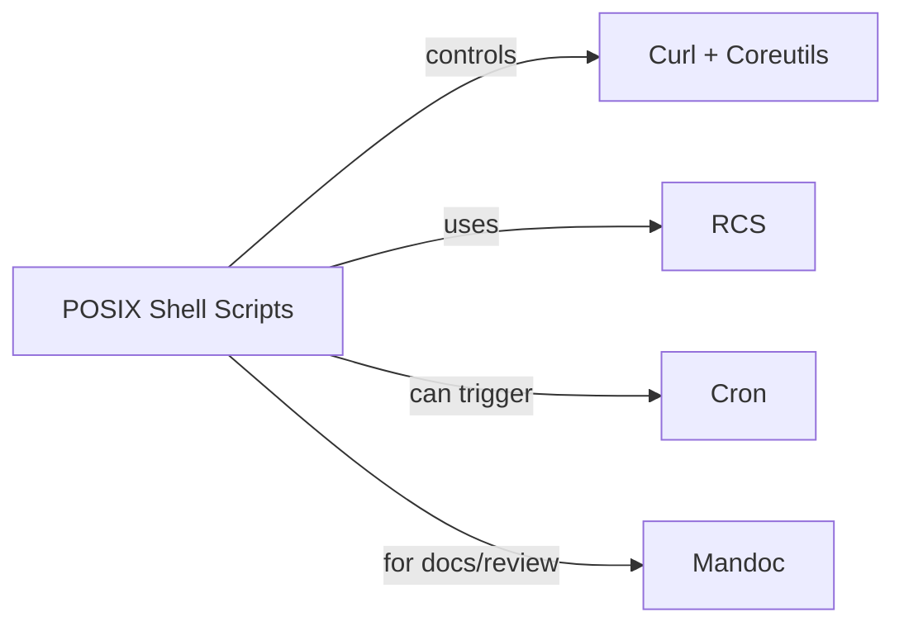

# Comprehensive Project Plan: Australian Sales Lead Call List Scraper

## 1. Project Objective


Produce a daily call list of at least 25 unique Australian companies—each record to include the prospect’s name, position, contact details (mobile and/or email), and business location. This data is for sales lead generation and business development. **Company names must always be unique** across days, using company history for deduplication.

---

## 2. Data Requirements

**Required data fields:**

- Company Name (must be unique, case-insensitive)
- Lead/Prospect Name
- Position/Title
- Location (state/region preferred)
- Mobile phone (normalised, digits only, e.g. 0412345678)
- Email (any domain)
- *Note*: Skip records if all contact details are missing.

### Data Model & Validation (rules to guarantee consistency)

#### Fields to extract from listing pages

- `company_name` (string)
- `title` (string)
- `location` (string)
- `summary` (string; optional)
- `job_id` (string; internal use)

> Note: Contact info (phone/email) is not expected on listing cards. Contacts are added **later** via manual enrichment from public sources.

#### Validation rules


- **Company required:** Skip any row missing `company_name`.
- **Company dedupe:** Case-insensitive deduplication of `company_name` only (no normalisation of whitespace/punctuation/suffixes).
- **Location does not break dedupe:** Same `company_name` with different locations is considered a duplicate for exclusion.
- **Contact presence (final call list):** Each final CSV row must include at least one valid contact (phone or email) after enrichment.

#### Regex validation

- **Email:** `[A-Za-z0-9._%+-]+@[A-Za-z0-9.-]+\.[A-Za-z]{2,}`
- **Phone:** digits only; convert `+61` mobiles to `0`-prefixed local (e.g., `+61412…` → `0412…`)

#### Historical exclusion

- Maintain `companies_history.txt` (one name per line).
- Before adding a row to today’s CSV, check case-insensitive membership against history; if present → skip.
- On acceptance, append new company names to history (manual or scripted).

```pdl
MODULE is_dup_company(company)  -- returns TRUE or FALSE
PURPOSE:
  Determine whether a company name (case-insensitive) exists in history.
INPUTS:
  company : string
OUTPUTS:
  TRUE  if company is present in history (case-insensitive)
  FALSE otherwise
ASSUMPTIONS:
  Historical values should not be modified; lowercasing is used only for comparison.
ALGORITHM:
  1. let lc := lowercase(company)    -- for comparison only
  2. if companies_history.txt contains company (case-insensitive match) then
       return TRUE
  3. else if companies_history_lower.txt contains lc (exact match) then
       return TRUE
  4. else
       return FALSE
NOTES:
  - Keep stored history values unchanged. Use lowercased copies only for comparisons.
```

---

## 3. Data Sources

- **Primary:** [Seek Australia](https://www.seek.com.au/) — job ads for company/employer field
- **Supplementary:** [DuckDuckGo Lite](https://lite.duckduckgo.com/lite) (manual Google-dork queries)
- **Supplementary:** [Google](https://www.google.com/) (manual Google-dork queries, .com.au only)
- Only scrape public web pages; **never** scrape private profiles (LinkedIn, Facebook etc.) or any site that disallows scraping under robots.txt or terms of service.

---

## 4. Geographic, Language & Domain Limitation

- Australian businesses only (.com.au websites/domains)
- All content in English (preferably en_AU.UTF-8)
- Seed job searches to cover all major Australian capitals and regions (see Appendix)

---

## 5. Success Criteria, KPIs & Acceptance

- **Daily target:** At least 25 unique companies (company names case-insensitive, no repeats checked against company history)
- Each row must have at least one valid contact detail (phone or email)
- Missing/incomplete company names: skip
- No duplicate companies across different days (per historical exclusion)
- If fewer than 25 leads are found, save the CSV regardless and record a warning in the logs
- Project “passes” if daily lists have valid contacts and no duplicate companies from the past

---

## 6. Volume, Frequency & Retention

- Minimum 25 leads per run
- Data refreshed daily
- Each new call list overwrites the previous day’s file (‘calllist_YYYY-MM-DD.csv’), history file is permanent (`companies_history.txt`)

---

## 7. Storage, Output Format & Encoding

- Output: UTF-8, CSV — one line per company/lead
- Filename: `calllist_YYYY-MM-DD.csv` (overwrites daily)
- History file: `companies_history.txt` (one company per line, maintained manually)
- Do not include source URLs, timestamps, or data lineage in the CSV
- **CSV Example:**

  ```csv
  company_name,prospect_name,title,phone,email,location
  XYZ Pty Ltd,John Smith,Managing Director,0412345678,email@xyz.com.au,Perth, WA
  ABC Ltd,Mary Jane,Owner,0498765432,test@abc.com.au,Darwin, NT
  ```

---

## 8. Tools & Tech Stack



### Essential

- Bourne Shell for scripting
- Curl for transferring data using URLS
- Coreutils for command line utilities
- RCS for manual version control

### Non-Essential

- mandoc (UNIX docs/manpages)
- Cron for automation and task scheduling

**Cross-platform**: Linux, BSD, macOS, and Windows.

---

## 9. Scraping Method & Strategy

- Use `grep`, `sed`, `awk`, `curl`, `tr`, `sort`, `uniq`, `date`, and `printf`
- Shell scripts to control fetch/parse/validate/deduplicate/report
- Helper binaries are allowed

When building your scraping run, start with a diverse collection of filtered listing URLs (see Filtered Seeds below) to cover job types, regions, work styles, and more—with no headless browser or form simulation required.

- **Google-dorking (manual):** CLI scripts generate Google or DuckDuckGo queries, which are opened in lynx), never automatically scraped
  - Limit domains to .com.au
  - Use flexible dorks (e.g. name/company/job/location/contact) for best results
  - Example dork: `"Jane Smith" "email" OR "phone" OR "mobile" site:.com.au`
- Appendix includes dork and seed templates

---

## 10. Data Validation, Deduplication & Cleaning

- Company name deduplication: case-insensitive matching only (no normalisation)
- Company + different location = considered duplicate for exclusion
- Do not normalise suffixes/whitespace/punctuation
- Skip rows missing company name
- Require at least one valid contact (phone or email)
- Email validation: `[A-Za-z0-9._%+-]+@[A-Za-z0-9.-]+\.[A-Za-z]{2,}`
- Phone validation: digits only, convert +61 to 0-prefix

---

## 11. Pacing, Anti-Bot & Reliability Policy

To minimise disruptions and respect rate-limit expectations:

- **Randomised delays:** Sleep a random amount between requests (e.g., 1.2–4.8 seconds) to avoid a machine-like cadence.
- **Exponential backoff & retries:**
  - Up to 3 retries per URL
  - Backoff schedule: 5s → 20s → 60s
  - Stop after the 3rd failure; log the error and move on.
- **User-Agent rotation:** Cycle a vetted pool of UA strings; avoid suspicious or outdated UAs.
- Do not use proxies or offshore scraping APIs
- **CAPTCHA detection:** If CAPTCHA text or known markers appear, log the event, skip this route, and **do not** attempt automated solving.
- **Timeouts:** Set connection and read timeouts (e.g., 10–15 seconds) to avoid hanging.
- **Respect robots.txt and ToS:** Only operate on listing pages and public endpoints suitable for automated access.

> **Outcome:** A conservative, respectful scraper that avoids throttling and reduces maintenance due to anti-bot defences.

**Shell backoff snippet (example):**

```pdl
MODULE fetch_with_backoff(url)  -- returns html_text or FAILURE
PURPOSE:
  Try to fetch the given URL up to three times, using exponential backoff on failure.
INPUTS:
  url : string
OUTPUTS:
  html_text on success
  FAILURE after three unsuccessful attempts
ALGORITHM:
  1. For attempt from 1 to 3 do
       a. Try to fetch url with a 15 second timeout
       b. If fetch succeeds then
            return retrieved html_text
       c. Else
            If attempt == 1 then wait 5 seconds
            If attempt == 2 then wait 20 seconds
            If attempt == 3 then wait 60 seconds
  2. If all attempts fail then return FAILURE
NOTES:
  - Use timeouts and record/log failed attempts for audit.
```

---

## 12. Error Handling, Logging & Monitoring

- Script logs all runs to `log.txt`
  - Include: timestamp, queried URLs, search terms
    - Number of unique records found
    - Errors/warnings (CAPTCHA, timeout etc.)
    - Warn if fallback (textual) “Next” detection was triggered or if duplicate pages were detected during pagination.
    - Add record-level debugging if ‘verbose’ enabled
    - Retain/rotate logs weekly (policy TBC)
- No external monitoring or alerting required

### Logging & Change Resilience

```mermaid
flowchart TD
    A[Run Starts] --> B[Write Log: Start Details]
    B --> C[Log Seed Processing]
    C --> D[Log Valid/Skipped Records]
    D --> E{Weekly Rotation?}
    E -- Yes --> F[Rotate Logs]
    E -- No --> G[Continue Logging]
    F --> G
  ```

Record enough context to investigate issues and site changes:

### Per run

- Timestamp (start/end)
- Seed URL (and derived pagination scheme)
- Total pages fetched for the seed
- Total listings parsed for the seed

- Number of valid output rows emitted
- Warnings and errors (timeouts, retries, fallback “Next” detection)

#### Weekly rotation

- Rotate logs weekly (policy TBD).
- Keep a summary index mapping date → seed → (pages, listings, status).

#### Change detection

- If automation attributes change or “Next” detection falls back to text:
  - Emit a `WARN` entry including the exact snippet around pagination.
  - Tag the seed with `ATTR_CHANGE=true` so audits can find it later.

> **Goal:** Fast root‑cause analysis when Seek adjusts markup or pagination behavior.

**Log line example:**

```log
2025-12-09T09:31:07Z seed=/jobs?keywords=admin&where=Perth%2C+WA model=offset pages=6 listings=132 ok=true warn=fallback_next=false errors=0
```

---

## 13. Security, Privacy & Compliance


- Only collect public information — no restricted/private data
- Do not scrape any site or page excluded by robots.txt or ToS
- Strictly observe Australian privacy law/ethical norms
- Admin can manually remove any person/company details from history if requested

### Compliance & Ethics

- **Robots.txt & ToS:** Always review site policies. Operate only on listing pages and public endpoints intended for automated access.
- **CAPTCHA & anti-bot:** If encountered, log and skip; do not bypass.
- **Privacy:** Collect only public information. Respect removal requests for persons or companies in history or outputs.
- **Minimal footprint:** Avoid concurrent flood; prefer serialised or lightly parallelised requests with conservative pacing.
- **Auditability:** Keep logs structured and retained for accountability.

---

## 14. Retention & Admin Control

- Daily call list is always overwritten
- Company history file (`companies_history.txt`) always retained and added via admin/manual only
- Manual RCS commit for company list/historic file

---

## 15. Scheduling & Automation

- Scraper script is triggered manually for now
- Cron scheduling (Unix/BSD/macOS/Windows) after MVP is accepted

---

## 16. Project Acceptance Criteria

- At least 25 unique companies per CSV file per day (case-insensitive, not in history)
- Each row contains at least one valid contact (phone/email)
- No duplicates across daily runs
- Less than 25 allowed as partial, write a warning to logs
- Output format, scripts, logs match this project scope and description

---

## 17. MVP / First Steps

- Write initial Shell scripts and helpers
- Create `seeds.txt` (Seek listing URLs + dork templates)
- Create and manage `companies_history.txt` (admin initiates)
- Document everything, structure logs for future audit

## Project Structure

A recommended, scalable scaffold for this repository (POSIX shell + `curl` + `coreutils` stack). Copy the tree below into the README for quick reference and to guide contributors.

```mermaid
flowchart TB
  %% Top-level project layout (folders & key files)
  subgraph ROOT["."]
    direction TB
    editorconfig[".editorconfig"]
    gitattributes[".gitattributes"]
    gitignore[".gitignore"]
    envfile[".env"]
    configs_root["config.ini / project.conf"]
    license["LICENSE"]
    readme["README.md"]
    seeds["seeds.txt"]
    history["companies_history.txt"]

    subgraph BIN["bin/"]
      bin_run["elvis-run"]
    end

    subgraph SCRIPTS["scripts/"]
      run_sh["run.sh"]
      fetch_sh["fetch.sh"]
      parse_sh["parse.sh"]
      dedupe_sh["dedupe.sh"]
      validate_sh["validate.sh"]
      enrich_sh["enrich.sh"]
      subgraph LIB["scripts/lib/"]
        http_utils["http_utils.sh"]
      end
    end

    subgraph CONFIGS["configs/"]
      seek_ini["seek-pagination.ini"]
    end

    subgraph DOCS["docs/"]
      runbook["runbook.md"]
      subgraph MAN["docs/man/"]
        manpage["elvis.1"]
      end
    end

    subgraph DATA["data/"]
      calllists["calllists/"]
      seeds_data["seeds/"]
    end

    logs["logs/"]
    tmp["tmp/"]
    examples["examples/"]
    github[".github/"]
    cron["cron/"]
    tests["tests/"]
  end

  %% relationships (visual helpers)
  readme --> SCRIPTS
  SCRIPTS --> LIB
  DATA --> calllists
  github --> workflows["workflows/ ci.yml"]
```



```text
.
├── .editorconfig             # Enforce UTF-8 and LF line endings
├── .gitattributes            # Enforce UTF-8 + LF normalisation
├── .gitignore                # Ignore logs, tmp, generated CSVs, and secrets
├── .env                      # Environment variables (should not be committed)
├── config.ini                # Primary configuration (template stored in `configs/`)
├── project.conf              # Alternate configuration format (optional)
├── LICENSE                   # Project license
├── README.md                 # Project documentation (this file)
├── seeds.txt                 # Seed URLs & dork templates
├── companies_history.txt     # Append-only company history (one name per line)
├── data/                     # Generated or curated data (see below)
│
├── bin/                      # Executable wrappers & launchers
│   └── elvis-run             # Wrapper that invokes `scripts/run.sh`
│
├── scripts/                  # POSIX shell scripts and orchestrators
│   ├── run.sh                # Top-level orchestrator
│   ├── fetch.sh              # HTTP fetch with retries and UA rotation
│   ├── parse.sh              # Parse listing pages into records
│   ├── dedupe.sh             # Deduplication helpers
│   ├── validate.sh           # Validation and normalisation rules
│   ├── enrich.sh             # Manual enrichment helpers & markers
│   └── lib/                  # Reusable shell libraries (timeouts, logging)
│       └── http_utils.sh
│
├── configs/                  # Configuration templates and examples (no secrets)
│   └── seek-pagination.ini
│
├── docs/                     # Documentation, runbook, and manpages
│   ├── runbook.md            # Run instructions and troubleshooting
│   └── man/                  # mandoc-compatible man pages (optional)
│       └── elvis.1
│
├── data/                     # Generated or curated data
│   ├── calllists/            # calllist_YYYY-MM-DD.csv (daily outputs)
│   └── seeds/                # curated seed templates (e.g., seeds.txt)
│
├── logs/                     # Runtime logs and rotated archives (ignored)
│   └── log.txt
│
├── tmp/                      # Runtime temp files (ignored)
│
├── examples/                 # Example outputs and sample fixtures
│   └── sample_calllist.csv
│
├── .github/                  # GitHub configuration and workflows
│   ├── workflows/
│   │   └── ci.yml            # CI checks (shellcheck, lint, basic smoke tests)
│   └── copilot-instructions.md
│
├── cron/                     # Example crontabs and scheduler snippets
│   └── elvis.cron
│
└── tests/                    # Integration & smoke tests
    ├── fixtures/
    └── run-tests.sh
```

> Notes:
>
> - Keep secrets out of Git (`.env` should be listed in `.gitignore`).
> - Use `scripts/lib/*.sh` for shared utilities; keep scripts small and testable.
> - Place generated outputs under `data/` or `data/calllists/` and add ignore patterns.

## Orchestration Flow (from Seeds to Final CSV)


1. **Load seeds:** Read `seeds.txt` (one URL per line).
2. **Route detection:** For each seed, pick pagination model (`start` vs `page`).
3. **Paginate:**
   - Fetch each page with backoff/timeouts.
   - Parse listings using stable selectors.
   - Stop when "Next" is absent (primary) or text fallback says so.
4. **Aggregate:** Append parsed rows to an in-memory or temporary store.
5. **Validate & dedupe:**
   - Drop rows missing `company_name`.
   - Case-insensitive dedupe `company_name` against today’s set and `companies_history.txt`.
6. **Enrich contacts (manual):**
   - Add `phone` and/or `email` from public sources.
   - Validate with regex; skip if both missing.
7. **Emit CSV:**
   - `calllist_YYYY-MM-DD.csv` (UTF-8).
   - Overwrite daily; keep the history file permanent.
8. **Log & rotate:**
   - Write run summaries; note any fallback detection.
   - Rotate logs weekly (policy TBD).

---

## Seek.com.au — Route-aware pagination (concise)

Overview

- Seek uses two distinct pagination models depending on the URL route. Detect the model for each seed URL and apply the corresponding pagination logic.
- Always stop when the page’s “Next” control disappears from the returned HTML; never assume a fixed page count.

### Pagination models


### Model A — Generic search (URLs containing `/jobs?` or `/jobs&`)

- Mechanism: `start=OFFSET` query parameter, OFFSET increases by 22:
  - Page 1 → `start=0`
  - Page 2 → `start=22`
  - Page k → `start=22*(k-1)`
- Stop condition: the Next control (e.g., `<span data-automation="page-next">Next</span>`) is absent from the returned HTML.
- Rationale: server-side offset pagination for generic searches.

### Model B — Category / region routes (paths containing `-jobs/in-`)

- Mechanism: `?page=N` (1-based). Page 1 usually has no `?page` parameter:
  - Page 1 → (no `?page`)
  - Page 2 → `?page=2`
  - Page k → `?page=k`
- Stop condition: the Next link is absent from the pagination component.
- Rationale: page-numbered UX and bookmarkable segments.

### Minimal Route Detector (PDL-style)

Use this compact, centralised module to determine the appropriate pagination model for each Seek listing seed URL.

```pdl
MODULE pick_pagination(url)  -- returns 'PAG_START' or 'PAG_PAGE'
PURPOSE:
  Choose which pagination model to use for a seed URL.
INPUTS:
  url : string
OUTPUTS:
  'PAG_START' for offset-based pagination
  'PAG_PAGE'  for page-number pagination
ALGORITHM:
  1. If url is empty then return 'PAG_START'  -- conservative default
  2. Else if url contains '/jobs?' or '/jobs&' then return 'PAG_START'
  3. Else if url contains '-jobs/in-' then return 'PAG_PAGE'
  4. Else return 'PAG_START'
NOTES:
  - Keep logic simple and conservative to avoid misrouting.
```

#### Usage pattern

1. Derive the starting URL from your seed
2. Call pick_pagination "$url" to decide whether to loop start or page
3. Use HTML "Next" checks to stop (e.g., grep for data-automation="page-next")

##### Combined pagination flow (PDL-style)

- Fetch pages and stop when the pagination control is absent.
- Parsing is delegated to a separate `parse_listings` module.

```pdl
MODULE run_pagination(initial_url)
PURPOSE:
  Detect pagination model and iterate pages, parsing listings until "Next" disappears.
ALGORITHM:
  1. model := pick_pagination(initial_url)
  2. IF model == 'PAG_START' THEN
       offset := 0
       LOOP
         url := initial_url + "&start=" + offset
         html := fetch_with_backoff(url)
         IF fetch failed then stop loop and log error
         parse_listings(html)  -- separate module handles extraction
         IF page_has_next(html) is FALSE then stop loop
         offset := offset + 22
         wait a short, randomised delay
       END LOOP
     ELSE  -- model == 'PAG_PAGE'
       page := 1
       base := initial_url
       LOOP
         url := base if page == 1 otherwise base + "?page=" + page
         html := fetch_with_backoff(url)
         IF fetch failed then stop loop and log error
         parse_listings(html)
         IF page_has_next(html) is FALSE then stop loop
         page := page + 1
         wait a short, randomised delay
       END LOOP
     END IF
NOTES:
  - Keep parsing and pagination detection separate for clarity and testability.
  - Respect timeouts and backoff on failures.
```

### Route-aware Examples (End-to-end crawl flow)

#### Generic search (`/jobs`) — offset loop (PDL)

```pdl
MODULE paginate_offset(base_url)
PURPOSE:
  Iterate search results using an offset parameter until there is no "Next" control.
ALGORITHM:
  1. offset := 0
  2. LOOP
       url := base_url + "&start=" + offset
       html := fetch_with_backoff(url)
       IF fetch failed then
         log error and STOP
       END IF
       parse_listings(html)
       IF no listings found then
         log warning and STOP
       END IF
       IF page_has_next(html) is FALSE then
         log info and STOP
       END IF
       offset := offset + 22
       wait a short randomised delay
     END LOOP
```

#### Category/region (`/<category>-jobs/in-<region>`) — page loop (PDL)

```pdl
MODULE paginate_page_number(base_url)
PURPOSE:
  Iterate search results using page numbers (1-based) until there is no "Next" control.
ALGORITHM:
  1. page := 1
  2. LOOP
       IF page == 1 THEN
         url := base_url
       ELSE
         url := base_url + "?page=" + page
       END IF
       html := fetch_with_backoff(url)
       IF fetch failed then
         log error and STOP
       END IF
       parse_listings(html)
       IF no listings found then
         log warning and STOP
       END IF
       IF page_has_next(html) is FALSE then
         log info and STOP
       END IF
       page := page + 1
       wait a short randomised delay
     END LOOP
```


## Notes & best practices

- Detect the model per seed URL — misdetection can skip pages or cause infinite loops.
- Use the presence/absence of the “Next” control in the returned HTML as the authoritative stop condition.
- Prefer stable selectors and automation attributes when parsing listing content (`<article>` roots, `data-automation` attributes, `data-*` ids, and anchor text). Avoid brittle CSS class names.
- Throttle requests and randomise small sleeps to reduce load and avoid triggering rate limits.

- **Job listing/card structure:**

### Selector Discipline (stable attributes vs brittle CSS)

Seek’s listing markup provides automation-friendly signals. Prefer these over CSS class names:

- **Job card root**: the `<article>` representing a “normal” job result.
- **Job title**: the anchor text for the title.
- **Company name**: the anchor text for employer.
- **Location**: the anchor text for location.
- **Short description**: the inline summary text.
- **Job identifier**: a `data-*` attribute unique to the listing.

#### Why avoid CSS class names?

Class names on modern sites change frequently in A/B tests and refactors. Automation-oriented attributes and structural tags are more stable and intentionally readable by scripts.

#### Parsing guidelines

- Anchor your extraction to automation markers first; if absent, fall back to surrounding semantic tags and textual anchors.
- Never rely on inner CSS names like `.style__Card__1a2b` (those are brittle).
- Handle minor whitespace/HTML entity variations safely (normalise text).

**Outcome:** More resilient scrapers that survive minor refactors without constant maintenance.

- Each job is: `<article data-automation="normalJob">...</article>`
  - **Title:** `<a data-automation="jobTitle">`
    - **Company:** `<a data-automation="jobCompany">`
    - **Location:** `<a data-automation="jobLocation">`
    - **Short description:** `<span data-automation="jobShortDescription">`
    - **Job ID:** `data-job-id` attribute
  - Only fields visible here can be automatically gathered.

- **Contact info (phone/email):**
  - **Not present** in Seek job cards — must be found by operator using dorks, company sites and public resources.

- **Search fields:**
  - **Keywords**: `<input id="keywords-input" name="keywords" type="text" ...>`
  - **Location**: `<input id="SearchBar__Where" name="where" type="search" ...>`

**Shell extraction outline (PDL):**

```pdl
MODULE parse_listings(html_text)
PURPOSE:
  Extract structured fields from raw listing HTML using stable markers.
INPUTS:
  html_text : string containing page HTML
OUTPUTS:
  A list of extracted records with fields: title, company, location, summary, job_id
ALGORITHM:
  1. Split html_text into article chunks at '</article>'
  2. For each chunk that contains 'data-automation="normalJob"' do
       a. title := extract text from marker 'data-automation="jobTitle"'
       b. company := extract text from marker 'data-automation="jobCompany"'
       c. location := extract text from marker 'data-automation="jobLocation"'
       d. summary := extract text from marker 'data-automation="jobShortDescription"' (if present)
       e. job_id := extract value of attribute 'data-job-id' (if present)
       f. If title is not empty then emit a record with the above fields
  3. Return the collection of records
NOTES:
  - Prefer automation attributes where available; fall back to surrounding semantic tags only if necessary.
```

### Seek.com.au JavaScript Behaviour & Scraping Approach (Update as of December 2025)

Although Seek.com.au’s search UI uses dynamic JavaScript features (type-ahead suggestions, toggle controls, etc.), **the actual job listing pages are server-rendered and respond to standard URL query parameters** such as `keywords`, `where`, and `start`. This makes scraping feasible using static tools.

**Key points:**

- **No headless browser required:**  
  Listing pages can be fetched by constructing query URLs and using static HTTP requests (e.g. `curl`). All job data and pagination elements appear in the HTML and can be parsed with shell tools (`grep`, `awk`, `sed`).
- Dynamic UI features (like suggestion dropdowns) are cosmetic and do not affect the underlying listing pages or endpoints.
- **Stable HTML selectors:**  
  Listing markup and pagination controls use stable `data-automation` attributes suitable for parsing and extraction.
- No official API or browser automation is necessary, as long as Seek continues to render results on the server-side.
- **If Seek ever transitions to client-only rendering (e.g. React hydration without SSR),** switch to an ed-alike browser (`edbrowse`) or suitable alternative for interactive/manual extraction.
- **Best practice:** Construct breadth-first collections of filtered seed listing URLs to avoid simulating the JavaScript search form.

**Bottom line:**  
For this project, **headless browser automation is not required** and static shell scripting is fully sufficient for daily scraping—future browser automation is optional and only needed if Seek changes its technical approach.

---

## Appendix: Seed URLs & Google-Dork Examples

### Seek.com.au Regions/Categories

|Location|Base URL|
|----------|----------|
|Perth, WA|<https://www.seek.com.au/fifo-jobs/in-All-Perth-WA>|
|Perth, WA (Fly-In Fly-Out)|<https://www.seek.com.au/fifo-jobs/in-All-Perth-WA?keywords=fly-in-fly-out>|
|Perth, WA (Mobilisation)|<https://www.seek.com.au/fifo-jobs/in-All-Perth-WA?keywords=mobilisation>|
|Perth, WA (Travel)|<https://www.seek.com.au/fifo-jobs/in-All-Perth-WA?keywords=travel>|
|Darwin, NT|<https://www.seek.com.au/fifo-jobs/in-All-Perth-WA>|
|...|... (See seeds.txt for full list)|

See 'Filtered Seeds' below for a breadth-first coverage strategy using server-rendered URLs with pre-set filters.

### Seeds & Coverage Checklist

Use this checklist to ensure breadth and correctness:

- [ ] Add generic `/jobs` seeds for core keyword+location pairs.
- [ ] Add work type seeds (full-time, part-time, contract, casual).
- [ ] Add remote option seeds (on-site, hybrid, remote).
- [ ] Add salary type and range seeds (annual/monthly/hourly + min/max).
- [ ] Add date listed seeds (1, 3, 7, 14, 31).
- [ ] Add major city/region seeds (capitals + key regions).
- [ ] Add category+region seeds (e.g., FIFO, Engineering, ICT, Healthcare).
- [ ] Ensure each seed is routed to the correct paginator (`start` vs `page`).
- [ ] Verify “Next” detection on the first and last pages; log any changes.
- [ ] Record run totals (seeds visited, pages fetched, listings parsed).

### Filtered Seeds (breadth-first coverage without JS simulation)

The search bar UX (type-ahead suggestions, toggles) is JavaScript-driven, but **listing pages themselves** are addressable with **pre-composed URLs**. Originating your crawl from filtered listing URLs avoids headless-browser automation for the search form while still covering the same search space.

#### Recommended seed types

- **Work type:** `/jobs/full-time`, `/jobs/part-time`, `/jobs/contract-temp`, `/jobs/casual-vacation`
- **Remote options:** `/jobs/on-site`, `/jobs/hybrid`, `/jobs/remote`
- **Salary filters (type and range):**
  - `salarytype=annual|monthly|hourly`
  - `salaryrange=min-max` (e.g., `salaryrange=30000-100000`)
- **Date listed:** `daterange=1|3|7|14|31` (today → monthly)
- **Cities/regions:** `/jobs/in-All-Perth-WA`, `/jobs/in-All-Sydney-NSW`, etc.
- **Category+region:** e.g., `/fifo-jobs/in-Western-Australia-WA`, `/engineering-jobs/in-All-Melbourne-VIC`

#### Workflow for seeds

1. Maintain `seeds.txt` with 1 URL per line, each representing a filtered slice.
2. For each seed:
   - Detect route (Batch 1) → choose pagination strategy.
   - Crawl until "Next" vanishes (Batch 4).
3. Merge parsed listings; dedupe by company (see Batch 9, Validation).
4. Log coverage (seed → pages visited → number of listings).

> **Why this works:** These links are server-rendered listing views that present enough HTML markers to parse without simulating client-side JS (type-ahead, form submissions).

```pdl
MODULE process_seeds(seed_file)
PURPOSE:
  Read seeds from a file and run the pagination process for each seed.
ALGORITHM:
  1. For each line 'seed' in seed_file do
       a. call run_pagination(seed)
       b. record the seed processing results in logs
  2. End
```

### Example Google/DuckDuckGo dorks

```text
"{Name}" "{Company}" (email OR "mobile number" OR contact OR phone OR mobile OR "email address" OR "contact information") site:.com.au
"{Name}" "{Company}" "contact us" site:.com.au
filetype:pdf "{Company}" "contact" site:.com.au
"{Company}" "contact details" site:.com.au
```

### Example Output Row

```text
company_name,prospect_name,title,phone,email,location
XYZ Pty Ltd,John Smith,Managing Director,0412345678,email@xyz.com.au,Perth, WA
ABC Ltd,Mary Jane,Owner,0498765432,test@abc.com.au,Darwin, NT
Business Name,Henry Smith,CFO,0411111111,henry@business.com.au,Adelaide, SA
```

---

## Risk Management Summary

- *Rate limiting & CAPTCHA*: Always pace requests conservatively, rotate UAs, and manually skip/record if CAPTCHA is hit
- *Data quality*: Strict rules and validation, with manual spot checks

---

## Deliverables

1. Full requirements document (this file)
2. Seed URLs and dork template file
3. Companies history file (admin-managed)
4. Scripts for CSV extraction, validation and error logging
5. Documentation/manuals for auditing and admin steps

---

## Search Bar & Automation Mapping

### Seek.com.au

- **Keywords Field**:  
  `<input id="keywords-input" name="keywords" type="text" ...>`
- **Location Field**:  
  `<input id="SearchBar__Where" name="where" type="search" ...>`
- **Search Button**:  
  `<span ...><span>SEEK</span></span>`
  - JS automation required to trigger searches

#### Shell example (PDL)

```pdl
MODULE fetch_url_once(url)
PURPOSE:
  Perform a single HTTP GET and return the page content.
INPUTS:
  url : string
OUTPUTS:
  page content on success
  error indicator on failure
ALGORITHM:
  1. Perform an HTTP GET with a reasonable timeout
  2. If successful return the response body
  3. Otherwise return an error
```

---

### DuckDuckGo Lite Field Mapping

- **Query Field:** `<input class="query" name="q" ...>`
- **Search Button:** `<input class="submit" type="submit" ...>`  
- Example: `http GET 'https://lite.duckduckgo.com/lite/?q=company+email+site:.com.au'`
- Interactive/manual only—never scraped or parsed automatically

---

### Google.com.au Field Mapping

- **Query Field:**  
  `<textarea class="gLFyf" id="APjFqb" name="q" ...>`
- **Search Button:**  
  `<input class="gNO89b" name="btnK" ...>`
- Example: `http GET 'https://www.google.com.au/search?q=company+email+site:.com.au'`
- Interactive/manual only—never scraped or parsed automatically

---

**Important:**  

- Always check robots.txt before scraping any site  
  - [Seek robots.txt](https://www.seek.com.au/robots.txt)
  - [DuckDuckGo robots.txt](https://duckduckgo.com/robots.txt)
  - [Google robots.txt](https://www.google.com.au/robots.txt)
- Only scrape Seek’s *search listing* pages (never job or profile detail pages)
- Google and DuckDuckGo: results used only to find contacts manually—not to be scraped

---

## Interactive Google-Dorking Workflow


Use CLI scripts to pick dorks, launch manual browser queries, and add enriched leads by hand.

**Basic shell:**

```pdl
MODULE choose_dork(dork_templates_file)
PURPOSE:
  Present a numbered list of dork templates to the operator and open the selected query in a browser.
ALGORITHM:
  1. Read all entries from dork_templates_file into a list
  2. Display each entry with a number (1..N)
  3. Prompt the operator to enter a number selection
  4. Let DORK_QUERY := the selected template
  5. Open the operator's browser with the query 'https://www.google.com.au/search?q=' + DORK_QUERY
NOTES:
  - This is intended for manual, interactive use only.
```

Results are reviewed manually and copied to the daily CSV.

---

## Changelog

- 23 December 2025: docs: consolidated README into a single commit and added comprehensive project plan (history rewritten and squashed for clarity)
- 9 December 2025: Added new "Orchestration Flow" section detailing the full stepwise scraping, validation, enrichment, and output process from seeds to CSV, based on improved analysis of Seek.com.au behaviour.
- 8 December 2025: All sections rewritten for selector stability and modern Seek.com.au markup, plus attention to Australian spelling, idiom and norms.
- 6 December 2025: Initial commit (project scaffold)

---

**This project strictly observes robots.txt, ToS, and only uses automation where clearly permitted. Manual/interactive protocols for dorking and enrichment are integral. Do not attempt to automate any part not explicitly allowed above.**
