# Comprehensive Project Plan: Australian Sales Lead Call List Scraper

## Table of Contents

- [Runbook](docs/runbook.md)
- [CHANGELOG](CHANGELOG.md)

## 1. Project Objective


Produce a daily call list of at least 25 unique Australian companies—each record
to include the prospect’s name, position, contact details (mobile and/or email),
and business location. This data is for sales lead generation and business
development. **Company names must always be unique** across days, using company
history for deduplication.

---

## 2. Data Requirements

**Required data fields:**

- Company Name (must be unique, case-insensitive)
- Lead/Prospect Name
- Position/Title
- Location (state/region preferred)
- Mobile phone (normalised, digits only, e.g. 0412345678)
- Email (any domain)
- _Note_: Skip records if all contact details are missing.

### Data Model & Validation (rules to guarantee consistency)

#### Fields to extract from listing pages

- `company_name` (string)
- `title` (string)
- `location` (string)
- `summary` (string; optional)
- `job_id` (string; internal use)

> Note: Contact info (phone/email) is not expected on listing cards. Contacts
> are added **later** via manual enrichment from public sources.

#### Validation rules

```mermaid
flowchart TD
    A[Record found in listing] --> B{Company Name Present?}
    B -- No --> X[Skip Record]
    B -- Yes --> C{Already in Today’s List?}
    C -- Yes --> X
    C -- No --> D{Exists in companies_history.txt?}
    D -- Yes --> X
    D -- No --> E[Manual Contact Enrichment]
    E --> F{At least one contact present?}
    F -- No --> X
    F -- Yes --> G[Save to CSV, Append to History]
```



- **Company required:** Skip any row missing `company_name`.
- **Company dedupe:** Case-insensitive deduplication of `company_name` only (no
  normalisation of whitespace/punctuation/suffixes).
- **Location does not break dedupe:** Same `company_name` with different
  locations is considered a duplicate for exclusion.
- **Contact presence (final call list):** Each final CSV row must include at
  least one valid contact (phone or email) after enrichment.

#### Regex validation

- **Email:** `[A-Za-z0-9._%+-]+@[A-Za-z0-9.-]+\.[A-Za-z]{2,}`
- **Phone:** digits only; convert `+61` mobiles to `0`-prefixed local (e.g.,
  `+61412…` → `0412…`)

#### Historical exclusion

- Maintain `companies_history.txt` (one name per line).
- Before adding a row to today’s CSV, check case-insensitive membership against
  history; if present → skip.
- On acceptance, append new company names to history (manual or scripted).

```pdl
MODULE is_dup_company(company)  -- returns TRUE or FALSE
PURPOSE:
  Determine whether a company name (case-insensitive) exists in history.
INPUTS:
  company : string
OUTPUTS:
  TRUE  if company is present in history (case-insensitive)
  FALSE otherwise
ASSUMPTIONS:
  Historical values should not be modified; lowercasing is used only for comparison.
ALGORITHM:
  1. let lc := lowercase(company)    -- for comparison only
  2. if companies_history.txt contains company (case-insensitive match) then
       return TRUE
  3. else if companies_history_lower.txt contains lc (exact match) then
       return TRUE
  4. else
       return FALSE
NOTES:
  - Keep stored history values unchanged. Use lowercased copies only for comparisons.
```

---

## 3. Data Sources

- **Primary:** [Seek Australia](https://www.seek.com.au/) — job ads for
  company/employer field
- **Supplementary:** [DuckDuckGo Lite](https://lite.duckduckgo.com/lite) (manual
  Google-dork queries)
- **Supplementary:** [Google](https://www.google.com/) (manual Google-dork
  queries, .com.au only)
- Only scrape public web pages; **never** scrape private profiles (LinkedIn,
  Facebook etc.) or any site that disallows scraping under robots.txt or terms
  of service.

---

## 4. Geographic, Language & Domain Limitation

- Australian businesses only (.com.au websites/domains)
- All content in English (preferably en_AU.UTF-8)
- Seed job searches to cover all major Australian capitals and regions (see
  Appendix)

---

## 5. Success Criteria, KPIs & Acceptance

- **Daily target:** At least 25 unique companies (company names
  case-insensitive, no repeats checked against company history)
- Each row must have at least one valid contact detail (phone or email)
- Missing/incomplete company names: skip
- No duplicate companies across different days (per historical exclusion)
- If fewer than 25 leads are found, save the CSV regardless and record a warning
  in the logs
- Project “passes” if daily lists have valid contacts and no duplicate companies
  from the past

---

## 6. Volume, Frequency & Retention

- Minimum 25 leads per run
- Data refreshed daily
- Each new call list overwrites the previous day’s file
  (‘calllist_YYYY-MM-DD.csv’), history file is permanent
  (`companies_history.txt`)

---

## 7. Storage, Output Format & Encoding

- Output: UTF-8, CSV — one line per company/lead
- Filename: `calllist_YYYY-MM-DD.csv` (overwrites daily)
- History file: `companies_history.txt` (one company per line, maintained
  manually)
- Do not include source URLs, timestamps, or data lineage in the CSV
- **CSV Example:**

  ```csv
  company_name,prospect_name,title,phone,email,location
  XYZ Pty Ltd,John Smith,Managing Director,0412345678,email@xyz.com.au,Perth, WA
  ABC Ltd,Mary Jane,Owner,0498765432,test@abc.com.au,Darwin, NT
  ```

---

## 8. Tools & Tech Stack


### Essential

- Bourne Shell (`sh`) for scripting
- `curl` for transferring data using URLS
- `coreutils` for command line utilities (e.g., `cp`, `mv`, `find`, `touch`,
  `ln`)
- `diff`, `patch`, `tar`, `cmp`, and `ed` for manual version control
- `tar` for efficient snapshots and restores
- Checksum utilities (`md5sum`, `sha1sum`) to detect changes and verify
  integrity

### Non-Essential

- `roff` or `nroff` (UNIX docs/manpages)
- `cron` for automation and task scheduling

**Cross-platform**: Linux, BSD, macOS, and Windows.

---

## Creating Manuals with roff and nroff 📖

### Overview

`roff` is the original Unix typesetting system used to write and format manual
pages. The `man` macro package (roff macros) provides a concise way to structure
sections like NAME, SYNOPSIS, DESCRIPTION, OPTIONS and EXAMPLES. Use `nroff` to
format roff sources for plain terminal viewing; use `groff` (GNU troff) when you
need richer output (UTF‑8, PostScript, PDF, HTML).

### Basic workflow & commands

- Create source pages under `docs/man/` (e.g., `docs/man/elvis.1`).
- View locally with `nroff` (terminal):

```sh
nroff -man docs/man/elvis.1 | less -R
```

- View a local file using `man` (some systems support `-l` for local files):

```sh
man -l docs/man/elvis.1
```

- Render UTF‑8 output with `groff` (if installed):

```sh
groff -Tutf8 -man docs/man/elvis.1 | less -R
```

- Produce a PDF with `groff` (if available):

```sh
groff -Tpdf -man docs/man/elvis.1 > docs/man/elvis.pdf
```

- Install manpages system‑wide (example for `man1` section):

```sh
mkdir -p /usr/local/share/man/man1
cp docs/man/elvis.1 /usr/local/share/man/man1/
compress -f /usr/local/share/man/man1/elvis.1  # or gzip elvis.1
mandb || true  # update mancache (may require root)
```

### Best practices

- Keep roff sources in `docs/man/` and name files with the proper section suffix
  (e.g., `.1` for user commands, `.8` for admin/system tools).
- Use standard macro sections: `.TH`, `.SH NAME`, `.SH SYNOPSIS`,
  `.SH DESCRIPTION`, `.SH OPTIONS`, `.SH EXAMPLES`, `.SH FILES`, `.SH AUTHOR`,
  `.SH BUGS`.
- Keep the NAME and SYNOPSIS concise and accurate — these are used by `man` and
  search tools.
- Add a simple `scripts/build-man.sh` that runs `nroff`/`groff` checks and
  optionally produces PDF/UTF‑8 text for review.
- When packaging or installing, place generated pages in the appropriate `manN`
  directory and update the man database with `mandb` where available.

### Minimal roff example (docs/man/elvis.1)

```roff
.TH ELVIS 1 "2025-12-24" "elvis 0.1" "User Commands"
.SH NAME
elvis \- produce daily Australian sales lead call lists
.SH SYNOPSIS
.B elvis
\fIOPTIONS\fR
.SH DESCRIPTION
.PP
elvis fetches listings, extracts companies and writes `calllist_YYYY-MM-DD.csv`.
.SH EXAMPLES
.TP
.B elvis -r
Run the full scraping run in dry-run mode.
```

---

---

## 9. Scraping Method & Strategy

- Use `grep`, `sed`, `awk`, `curl`, `tr`, `sort`, `uniq`, `date`, and `printf`
- Shell scripts to control fetch/parse/validate/deduplicate/report
- Helper binaries are allowed

When building your scraping run, start with a diverse collection of filtered
listing URLs (see Filtered Seeds below) to cover job types, regions, work
styles, and more—with no headless browser or form simulation required.

- **Google-dorking (manual):** CLI scripts generate Google or DuckDuckGo
  queries, which are opened in lynx), never automatically scraped
  - Limit domains to .com.au
  - Use flexible dorks (e.g. name/company/job/location/contact) for best results
  - Example dork: `"Jane Smith" "email" OR "phone" OR "mobile" site:.com.au`
- Appendix includes dork and seed templates

---

## 10. Data Validation, Deduplication & Cleaning

- Company name deduplication: case-insensitive matching only (no normalisation)
- Company + different location = considered duplicate for exclusion
- Do not normalise suffixes/whitespace/punctuation
- Skip rows missing company name
- Require at least one valid contact (phone or email)
- Email validation: `[A-Za-z0-9._%+-]+@[A-Za-z0-9.-]+\.[A-Za-z]{2,}`
- Phone validation: digits only, convert +61 to 0-prefix

---

## 11. Pacing, Anti-Bot & Reliability Policy

To minimise disruptions and respect rate-limit expectations:

- **Randomised delays:** Sleep a random amount between requests (e.g., 1.2–4.8
  seconds) to avoid a machine-like cadence.
- **Exponential backoff & retries:**
  - Up to 3 retries per URL
  - Backoff schedule: 5s → 20s → 60s
  - Stop after the 3rd failure; log the error and move on.
  - Special-case HTTP 403: by default `RETRY_ON_403=true` and the fetcher will
    add `EXTRA_403_RETRIES` (default `2`), rotate User-Agent, and retry with
    backoff. The fetcher also sends browser-like headers (`Accept`,
    `Accept-Language`, `Referer`) and enables compressed transfer to reduce the
    chance of 403 responses. Set `RETRY_ON_403=false` to disable this behaviour.
- **User-Agent rotation:** Cycle a vetted pool of UA strings; avoid suspicious
  or outdated UAs. By default the project will use `data/ua.txt` (if present) as
  the UA list; set `UA_LIST_PATH` to override. Lines in the UA list are cleaned
  (surrounding quotes removed, whitespace trimmed). Use `ALLOW_BOTS=true` to
  allow known crawler UAs (not recommended).
- Do not use proxies or offshore scraping APIs
- **CAPTCHA detection:** If CAPTCHA text or known markers appear, log the event,
  skip this route, and **do not** attempt automated solving.
- **Timeouts:** Set connection and read timeouts (e.g., 10–15 seconds) to avoid
  hanging.
- **Respect robots.txt and ToS:** Only operate on listing pages and public
  endpoints suitable for automated access.

> **Outcome:** A conservative, respectful scraper that avoids throttling and
> reduces maintenance due to anti-bot defences.

**Shell backoff snippet (example):**

```pdl
MODULE fetch_with_backoff(url)  -- returns html_text or FAILURE
PURPOSE:
  Try to fetch the given URL up to three times, using exponential backoff on failure.
INPUTS:
  url : string
OUTPUTS:
  html_text on success
  FAILURE after three unsuccessful attempts
ALGORITHM:
  1. For attempt from 1 to 3 do
       a. Try to fetch url with a 15 second timeout
       b. If fetch succeeds then
            return retrieved html_text
       c. Else
            If attempt == 1 then wait 5 seconds
            If attempt == 2 then wait 20 seconds
            If attempt == 3 then wait 60 seconds
  2. If all attempts fail then return FAILURE
NOTES:
  - Use timeouts and record/log failed attempts for audit.
```

---

## 12. Error Handling, Logging & Monitoring

- Script logs all runs to `log.txt`
  - Include: timestamp, queried URLs, search terms
    - Number of unique records found
    - Errors/warnings (CAPTCHA, timeout etc.)
    - Warn if fallback (textual) “Next” detection was triggered or if duplicate
      pages were detected during pagination.
    - Add record-level debugging if ‘verbose’ enabled
    - Retain/rotate logs weekly (policy TBC)
- No external monitoring or alerting required

### Logging & Change Resilience


Record enough context to investigate issues and site changes:

### Per run

- Timestamp (start/end)
- Seed URL (and derived pagination scheme)
- Total pages fetched for the seed
- Total listings parsed for the seed

- Number of valid output rows emitted
- Warnings and errors (timeouts, retries, fallback “Next” detection)

#### Weekly rotation

- Rotate logs weekly (policy TBD).
- Keep a summary index mapping date → seed → (pages, listings, status).

#### Change detection

- If automation attributes change or “Next” detection falls back to text:
  - Emit a `WARN` entry including the exact snippet around pagination.
  - Tag the seed with `ATTR_CHANGE=true` so audits can find it later.

> **Goal:** Fast root‑cause analysis when Seek adjusts markup or pagination
> behavior.

**Log line example:**

```log
2025-12-09T09:31:07Z seed=/jobs?keywords=admin&where=Perth%2C+WA model=offset pages=6 listings=132 ok=true warn=fallback_next=false errors=0
```

---

## 13. Security, Privacy & Compliance


- Only collect public information — no restricted/private data
- Do not scrape any site or page excluded by robots.txt or ToS
- Strictly observe Australian privacy law/ethical norms
- Admin can manually remove any person/company details from history if requested

### Compliance & Ethics

- **Robots.txt & ToS:** Always review site policies. Operate only on listing
  pages and public endpoints intended for automated access.
- **CAPTCHA & anti-bot:** If encountered, log and skip; do not bypass.
- **Privacy:** Collect only public information. Respect removal requests for
  persons or companies in history or outputs.
- **Minimal footprint:** Avoid concurrent flood; prefer serialised or lightly
  parallelised requests with conservative pacing.
- **Auditability:** Keep logs structured and retained for accountability.

---

## 14. Retention & Admin Control

- Daily call list is always overwritten
- Company history file (`companies_history.txt`) always retained and added via
  admin/manual only

### Mini VCS Integration 🔧

To keep a simple, auditable history of important project files (for example
`companies_history.txt`, `data/seeds/`, and configuration files) we use a
lightweight, POSIX-friendly "mini VCS" based on standard utilities already
available in POSIX environments.

**Goals:** keep snapshots, generate small patches, verify integrity, and make
restores straightforward without requiring a full Git install.

What it uses:

- Snapshot archives: `tar` (+ `gzip` / `xz` if available)
- Diffs and patches: `diff -u` and `patch -p0`
- File comparison: `cmp`, `md5sum`/`sha1sum`
- Small edits & scripted automation: `ed`, `sed`, `awk` (when needed)
- Filesystem utilities: `cp`, `mv`, `find`, `touch`, `ln`, `mkdir`

The `.snapshots/` directory

- Location: `.snapshots/` (at project root) — included in `.gitignore` if you
  use Git for code but want lightweight, local snapshots kept separately.
- Contents:
  - `snap-YYYY-MM-DDTHHMMSS.tar.gz` — full snapshots of selected paths
  - `patches/` — `snapname.patch` (unified diffs generated between snapshots)
  - `checksums/` — `snap-YYYY-MM-DDTHHMMSS.sha1` for quick integrity checks
  - `index` — a simple text index mapping snapshot names to descriptions

Basic workflow (conceptual):

1. Create a snapshot: `tar -czf .snapshots/snap-&lt;ts&gt;.tar.gz <paths>` and
   write a checksum.
2. When changes are made, create a patch:
   `diff -u old/ new/ > .snapshots/patches/&lt;name&gt;.patch`.
3. Apply a patch: `patch -p0 &lt; .snapshots/patches/&lt;name&gt;.patch` to a
   working copy.
4. Restore from snapshot:
   `tar -xzf .snapshots/snap-&lt;ts&gt;.tar.gz -C &lt;target&gt;`.

Mermaid diagram — Mini VCS workflow

```mermaid
flowchart LR
  A[Create Snapshot\n(.snapshots/snap-<ts>.tar.gz)] --> B[Store checksum\n(.snapshots/checksums/*.sha1)]
  B --> C[Detect Changes\n(compare with previous snapshot)]
  C --> D[Generate Patch\n(.snapshots/patches/<name>.patch)]
  D --> E[Apply Patch\n(patch -p0 < patchfile)]
  A --> F[Restore Snapshot\n(tar -xzf .snapshots/snap-&lt;ts&gt;.tar.gz -C target)]
  E --> G[Record in index/log]
```

Practical commands & examples

- Create snapshot (full):

```sh
# create snapshot of important paths
ts=$(date -u +%Y%m%dT%H%M%SZ)
tar -czf .snapshots/snap-$ts.tar.gz companies_history.txt data/seeds configs && sha1sum .snapshots/snap-$ts.tar.gz > .snapshots/checksums/snap-$ts.sha1
```

- Generate a patch between two extracted snapshots (or working tree):

```sh
diff -uNr old/ new/ > .snapshots/patches/changes-$ts.patch
```

- Apply a patch to a working copy:

```sh
patch -p0 < .snapshots/patches/changes-$ts.patch
```

- Verify snapshot integrity:

```sh
sha1sum -c .snapshots/checksums/snap-$ts.sha1
```

Additional helper utilities (recommended):

- `find` — select paths to snapshot by pattern
- `xargs` — batch operations
- `gzip`/`xz` — compress snapshots
- `md5sum`/`sha1sum` — checksums
- `ln` — maintain latest snapshot symlink: `.snapshots/latest` → `snap-...`

Polyglot pseudocode (POSIX-friendly & portable)

```pdl
MODULE create_snapshot(paths[], description)
PURPOSE:
  Create a timestamped tarball snapshot of 'paths' and record a checksum and index entry.
INPUTS:
  paths[] : array of file/directory paths
  description : short text
OUTPUTS:
  snapshot_name : string (e.g., snap-YYYYMMDDTHHMMSS.tar.gz)
ALGORITHM:
  1. ts := utc_timestamp()
  2. snapshot_name := 'snap-' + ts + '.tar.gz'
  3. tar -czf .snapshots/ + snapshot_name paths[]
  4. checksum := sha1sum .snapshots/ + snapshot_name
  5. write checksum to .snapshots/checksums/snap- + ts + '.sha1'
  6. append "snapshot_name | ts | description" to .snapshots/index
  7. create or update symlink .snapshots/latest → snapshot_name
  8. return snapshot_name

MODULE generate_patch(base_dir, new_dir, patch_name)
PURPOSE:
  Produce a unified diff between two trees and store it in .snapshots/patches.
INPUTS:
  base_dir : directory for base
  new_dir  : directory for new
  patch_name : output patch filename
OUTPUTS:
  path to generated patch
ALGORITHM:
  1. diff -uNr base_dir new_dir > .snapshots/patches/ + patch_name
  2. return .snapshots/patches/ + patch_name

MODULE apply_patch(patch_file, target_dir)
PURPOSE:
  Apply a stored patch to a working copy
INPUTS:
  patch_file : path to patch
  target_dir : directory to apply patch in
ALGORITHM:
  1. cd target_dir
  2. patch -p0 < patch_file
  3. verify with 'git status' or 'cmp' / 'sha1sum' as suitable

MODULE restore_snapshot(snapshot_name, target_dir)
PURPOSE:
  Restore a named snapshot into target_dir
ALGORITHM:
  1. tar -xzf .snapshots/ + snapshot_name -C target_dir
  2. verify checksum with sha1sum -c .snapshots/checksums/snap-<ts>.sha1
```

Notes & policy

- This mini VCS is **not** a replacement for a distributed VCS like Git for
  source code, but it is a practical, auditable tool to track snapshots and
  patches for generated data (call lists, seeds, and history files) in
  environments where installing Git may be impractical.
- Keep `.snapshots/` in `.gitignore` if you use Git for source code to avoid
  storing large archives in the repository.
- Use checksums and an index file for basic auditability.

---

## 15. Scheduling & Automation

- Scraper script is triggered manually for now
- Cron scheduling (Unix/BSD/macOS/Windows) after MVP is accepted

---

## 16. Project Acceptance Criteria

- At least 25 unique companies per CSV file per day (case-insensitive, not in
  history)
- Each row contains at least one valid contact (phone/email)
- No duplicates across daily runs
- Less than 25 allowed as partial, write a warning to logs
- Output format, scripts, logs match this project scope and description

---

## 17. MVP / First Steps

- Write initial Shell scripts and helpers
- Create `data/seeds/seeds.csv` (Seek listing URLs + dork templates). Add a
  `seed_id` column to enable per-seed overrides in
  `configs/seek-pagination.ini`.
- Create and manage `companies_history.txt` (admin initiates)
- Document everything, structure logs for future audit

## Project Structure

<!-- AUTO-GENERATED-PROJECT-TREE:START -->

A generated project scaffold (updated by `scripts/update_readme.sh`) — do not
edit manually.


```text
<!-- AUTO-GENERATED-PROJECT-TREE:TEXT-START -->
.
├── audit.txt
├── bin
│   ├── elvis-run
├── CHANGELOG.md
├── companies_history.txt
├── configs
│   ├── seek-pagination.ini
│   ├── user_agents.txt
├── cron
│   ├── elvis.cron
├── data
│   ├── calllists
│   ├── seeds
│   ├── ua.txt
├── docs
│   ├── man
│   ├── runbook.md
├── examples
│   ├── sample_calllist.csv
│   ├── sample_seeds.csv
├── failer.count
├── LICENSE
├── logs
│   ├── log.txt
│   ├── network.log
├── project.conf
├── README.md
├── results.csv
├── scripts
│   ├── archive.sh
│   ├── choose_dork.sh
│   ├── cleanup.sh
│   ├── dedupe.sh
│   ├── dedupe_status.sh
│   ├── deduper.sh
├── summary.txt
├── tests
│   ├── run-tests.sh
│   ├── test_update_readme.sh
├── tmp
│   ├── cleanup.status
├── TODO.md
<!-- AUTO-GENERATED-PROJECT-TREE:TEXT-END -->
```

<!-- AUTO-GENERATED-PROJECT-TREE:END -->

### Commands

- `bin/elvis-run` — master orchestrator (see `bin/elvis-run help`)
- `scripts/archive.sh` — scripts/archive.sh
- `scripts/choose_dork.sh` — scripts/choose_dork.sh
- `scripts/cleanup.sh` — scripts/cleanup.sh
- `scripts/dedupe.sh` — scripts/dedupe.sh
- `scripts/dedupe_status.sh` — scripts/dedupe_status.sh
- `scripts/deduper.sh` — scripts/deduper.sh
- `scripts/end_sequence.sh` — scripts/end_sequence.sh
- `scripts/enrich.sh` — scripts/enrich.sh
- `scripts/enrich_status.sh` — scripts/enrich_status.sh
- `scripts/fetch.sh` — scripts/fetch.sh
- `scripts/get_transaction_data.sh` — scripts/get_transaction_data.sh
- `scripts/init-help.sh` — scripts/init-help.sh
- `scripts/log_status.sh` — scripts/log_status.sh
- `scripts/parse.sh` — scripts/parse.sh
- `scripts/run.sh` — scripts/run.sh
- `scripts/set_status.sh` — scripts/set_status.sh
- `scripts/summarise.sh` — scripts/summarise.sh
- `scripts/update_config_examples.sh` — scripts/update_config_examples.sh
- `scripts/update_readme.sh` — scripts/update_readme.sh
- `scripts/validate.sh` — scripts/validate.sh

## Configuration and Precedence

- **Canonical config file:** `project.conf` (key=value) — used for _non-secret_
  operational defaults.
- **Secrets & runtime overrides:** environment variables / `.env` (highest
  precedence).
- **Site-specific behaviour:** `configs/seek-pagination.ini` — pagination model,
  selectors, and per-seed overrides.
- **Seed manifest:** `data/seeds/seeds.csv` with header
  `seed_id,location,base_url`. Use the `seed_id` to reference per-seed overrides
  in `seek-pagination.ini`.

Precedence rule (applies to scripts):

1. Environment variables (`.env` / runtime) — highest priority
2. `project.conf` — operator/deployment defaults
3. Built-in script defaults — fallback

Notes:

- Prefer `project.conf` for operational tuning (timeouts, retries, limits). Keep
  secrets in `.env` or a secret manager.
- `config.ini` is deprecated in favour of `project.conf`; old content is
  preserved in `config.ini` for reference.
- Scripts should log the source (env/project.conf/default) for each key used to
  aid auditing.

Example (per-seed override):

- In `data/seeds/seeds.csv`: `seed_id=seek_fifo_perth`
- In `configs/seek-pagination.ini` `[overrides]` add:

```ini
  # seek_fifo_perth

  # model = PAG_PAGE

  # page_param = page

```

This design keeps site logic and selectors separated (`seek-pagination.ini`),
while operational defaults are easy for operators to manage (`project.conf`).

> Notes:
>
> - Keep secrets out of Git (`.env` should be listed in `.gitignore`).
> - Use `scripts/lib/*.sh` for shared utilities; keep scripts small and
>   testable.
> - Place generated outputs under `data/` or `data/calllists/` and add ignore
>   patterns.

## Orchestration Flow (from Seeds to Final CSV)


1. **Load seeds:** Read `seeds.csv` (one URL per line).
2. **Route detection:** For each seed, pick pagination model (`start` vs
   `page`).
3. **Paginate:**
   - Fetch each page with backoff/timeouts.
   - Parse listings using stable selectors.
   - Stop when "Next" is absent (primary) or text fallback says so.
4. **Aggregate:** Append parsed rows to an in-memory or temporary store.
5. **Validate & dedupe:**
   - Drop rows missing `company_name`.
   - Case-insensitive dedupe `company_name` against today’s set and
     `companies_history.txt`.
6. **Enrich contacts (manual):**
   - Add `phone` and/or `email` from public sources.
   - Validate with regex; skip if both missing.
7. **Emit CSV:**
   - `calllist_YYYY-MM-DD.csv` (UTF-8).
   - Overwrite daily; keep the history file permanent.
8. **Log & rotate:**
   - Write run summaries; note any fallback detection.
   - Rotate logs weekly (policy TBD).

---

## Seek.com.au — Route-aware pagination (concise)

Overview

- Seek uses two distinct pagination models depending on the URL route. Detect
  the model for each seed URL and apply the corresponding pagination logic.
- Always stop when the page’s “Next” control disappears from the returned HTML;
  never assume a fixed page count.

### Pagination models


### Model A — Generic search (URLs containing `/jobs?` or `/jobs&`)

- Mechanism: `start=OFFSET` query parameter, OFFSET increases by 22:
  - Page 1 → `start=0`
  - Page 2 → `start=22`
  - Page k → `start=22*(k-1)`
- Stop condition: the Next control (e.g.,
  `<span data-automation="page-next">Next</span>`) is absent from the returned
  HTML.
- Rationale: server-side offset pagination for generic searches.

### Model B — Category / region routes (paths containing `-jobs/in-`)

- Mechanism: `?page=N` (1-based). Page 1 usually has no `?page` parameter:
  - Page 1 → (no `?page`)
  - Page 2 → `?page=2`
  - Page k → `?page=k`
- Stop condition: the Next link is absent from the pagination component.
- Rationale: page-numbered UX and bookmarkable segments.

### Minimal Route Detector (PDL-style)

Use this compact, centralised module to determine the appropriate pagination
model for each Seek listing seed URL.

```pdl
MODULE pick_pagination(url)  -- returns 'PAG_START' or 'PAG_PAGE'
PURPOSE:
  Choose which pagination model to use for a seed URL.
INPUTS:
  url : string
OUTPUTS:
  'PAG_START' for offset-based pagination
  'PAG_PAGE'  for page-number pagination
ALGORITHM:
  1. If url is empty then return 'PAG_START'  -- conservative default
  2. Else if url contains '/jobs?' or '/jobs&' then return 'PAG_START'
  3. Else if url contains '-jobs/in-' then return 'PAG_PAGE'
  4. Else return 'PAG_START'
NOTES:
  - Keep logic simple and conservative to avoid misrouting.
```

#### Usage pattern

1. Derive the starting URL from your seed
2. Call pick_pagination "$url" to decide whether to loop start or page
3. Use HTML "Next" checks to stop (e.g., grep for data-automation="page-next")

##### Combined pagination flow (PDL-style)

- Fetch pages and stop when the pagination control is absent.
- Parsing is delegated to a separate `parse_listings` module.

```pdl
MODULE run_pagination(initial_url)
PURPOSE:
  Detect pagination model and iterate pages, parsing listings until "Next" disappears.
ALGORITHM:
  1. model := pick_pagination(initial_url)
  2. IF model == 'PAG_START' THEN
       offset := 0
       LOOP
         url := initial_url + "&start=" + offset
         html := fetch_with_backoff(url)
         IF fetch failed then stop loop and log error
         parse_listings(html)  -- separate module handles extraction
         IF page_has_next(html) is FALSE then stop loop
         offset := offset + 22
         wait a short, randomised delay
       END LOOP
     ELSE  -- model == 'PAG_PAGE'
       page := 1
       base := initial_url
       LOOP
         url := base if page == 1 otherwise base + "?page=" + page
         html := fetch_with_backoff(url)
         IF fetch failed then stop loop and log error
         parse_listings(html)
         IF page_has_next(html) is FALSE then stop loop
         page := page + 1
         wait a short, randomised delay
       END LOOP
     END IF
NOTES:
  - Keep parsing and pagination detection separate for clarity and testability.
  - Respect timeouts and backoff on failures.
```

### Route-aware Examples (End-to-end crawl flow)

#### Generic search (`/jobs`) — offset loop (PDL)

```pdl
MODULE paginate_offset(base_url)
PURPOSE:
  Iterate search results using an offset parameter until there is no "Next" control.
ALGORITHM:
  1. offset := 0
  2. LOOP
       url := base_url + "&start=" + offset
       html := fetch_with_backoff(url)
       IF fetch failed then
         log error and STOP
       END IF
       parse_listings(html)
       IF no listings found then
         log warning and STOP
       END IF
       IF page_has_next(html) is FALSE then
         log info and STOP
       END IF
       offset := offset + 22
       wait a short randomised delay
     END LOOP
```

#### Category/region (`/<category>-jobs/in-<region>`) — page loop (PDL)

```pdl
MODULE paginate_page_number(base_url)
PURPOSE:
  Iterate search results using page numbers (1-based) until there is no "Next" control.
ALGORITHM:
  1. page := 1
  2. LOOP
       IF page == 1 THEN
         url := base_url
       ELSE
         url := base_url + "?page=" + page
       END IF
       html := fetch_with_backoff(url)
       IF fetch failed then
         log error and STOP
       END IF
       parse_listings(html)
       IF no listings found then
         log warning and STOP
       END IF
       IF page_has_next(html) is FALSE then
         log info and STOP
       END IF
       page := page + 1
       wait a short randomised delay
     END LOOP
```


## Notes & best practices

- Detect the model per seed URL — misdetection can skip pages or cause infinite
  loops.
- Use the presence/absence of the “Next” control in the returned HTML as the
  authoritative stop condition.
- Prefer stable selectors and automation attributes when parsing listing content
  (`<article>` roots, `data-automation` attributes, `data-*` ids, and anchor
  text). Avoid brittle CSS class names.
- Throttle requests and randomise small sleeps to reduce load and avoid
  triggering rate limits.

- **Job listing/card structure:**

### Selector Discipline (stable attributes vs brittle CSS)

Seek’s listing markup provides automation-friendly signals. Prefer these over
CSS class names:

- **Job card root**: the `<article>` representing a “normal” job result.
- **Job title**: the anchor text for the title.
- **Company name**: the anchor text for employer.
- **Location**: the anchor text for location.
- **Short description**: the inline summary text.
- **Job identifier**: a `data-*` attribute unique to the listing.

#### Why avoid CSS class names?

Class names on modern sites change frequently in A/B tests and refactors.
Automation-oriented attributes and structural tags are more stable and
intentionally readable by scripts.

#### Parsing guidelines

- Anchor your extraction to automation markers first; if absent, fall back to
  surrounding semantic tags and textual anchors.
- Never rely on inner CSS names like `.style__Card__1a2b` (those are brittle).
- Handle minor whitespace/HTML entity variations safely (normalise text).

**Outcome:** More resilient scrapers that survive minor refactors without
constant maintenance.

- Each job is: `<article data-automation="normalJob">...</article>`

  - **Title:** `<a data-automation="jobTitle">`
    - **Company:** `<a data-automation="jobCompany">`
    - **Location:** `<a data-automation="jobLocation">`
    - **Short description:** `<span data-automation="jobShortDescription">`
    - **Job ID:** `data-job-id` attribute
  - Only fields visible here can be automatically gathered.

- **Contact info (phone/email):**

  - **Not present** in Seek job cards — must be found by operator using dorks,
    company sites and public resources.

- **Search fields:**
  - **Keywords**: `<input id="keywords-input" name="keywords" type="text" ...>`
  - **Location**: `<input id="SearchBar__Where" name="where" type="search" ...>`

**Shell extraction outline (PDL):**

```pdl
MODULE parse_listings(html_text)
PURPOSE:
  Extract structured fields from raw listing HTML using stable markers.
INPUTS:
  html_text : string containing page HTML
OUTPUTS:
  A list of extracted records with fields: title, company, location, summary, job_id
ALGORITHM:
  1. Split html_text into article chunks at '</article>'
  2. For each chunk that contains 'data-automation="normalJob"' do
       a. title := extract text from marker 'data-automation="jobTitle"'
       b. company := extract text from marker 'data-automation="jobCompany"'
       c. location := extract text from marker 'data-automation="jobLocation"'
       d. summary := extract text from marker 'data-automation="jobShortDescription"' (if present)
       e. job_id := extract value of attribute 'data-job-id' (if present)
       f. If title is not empty then emit a record with the above fields
  3. Return the collection of records
NOTES:
  - Prefer automation attributes where available; fall back to surrounding semantic tags only if necessary.
```

### Seek.com.au JavaScript Behaviour & Scraping Approach (Update as of Dec. 2025)

Although Seek.com.au’s search UI uses dynamic JavaScript features (type-ahead
suggestions, toggle controls, etc.), **the actual job listing pages are
server-rendered and respond to standard URL query parameters** such as
`keywords`, `where`, and `start`. This makes scraping feasible using static
tools.

**Key points:**

- **No headless browser required:**  
  Listing pages can be fetched by constructing query URLs and using static HTTP
  requests (e.g. `curl`). All job data and pagination elements appear in the
  HTML and can be parsed with shell tools (`grep`, `awk`, `sed`).
- Dynamic UI features (like suggestion dropdowns) are cosmetic and do not affect
  the underlying listing pages or endpoints.
- **Stable HTML selectors:**  
  Listing markup and pagination controls use stable `data-automation` attributes
  suitable for parsing and extraction.
- No official API or browser automation is necessary, as long as Seek continues
  to render results on the server-side.
- **If Seek ever transitions to client-only rendering (e.g. React hydration
  without SSR),** switch to a headless browser or suitable alternative for
  interactive/manual extraction.
- **Best practice:** Construct breadth-first collections of filtered seed
  listing URLs to avoid simulating the JavaScript search form.

**Bottom line:**  
For this project, **headless browser automation is not required** and static
shell scripting is fully sufficient for daily scraping—future browser automation
is optional and only needed if Seek changes its technical approach.

---

## Appendix: Seed URLs & Google-Dork Examples

### Seek.com.au Regions/Categories

| Location                   | Base URL                                                                    |
| -------------------------- | --------------------------------------------------------------------------- |
| Perth, WA                  | <https://www.seek.com.au/fifo-jobs/in-All-Perth-WA>                         |
| Perth, WA (Fly-In Fly-Out) | <https://www.seek.com.au/fifo-jobs/in-All-Perth-WA?keywords=fly-in-fly-out> |
| Perth, WA (Mobilisation)   | <https://www.seek.com.au/fifo-jobs/in-All-Perth-WA?keywords=mobilisation>   |
| Perth, WA (Travel)         | <https://www.seek.com.au/fifo-jobs/in-All-Perth-WA?keywords=travel>         |
| Darwin, NT                 | <https://www.seek.com.au/fifo-jobs/in-All-Darwin-NT>                        |
| ...                        | ... (See seeds.csv for full list)                                           |

See 'Filtered Seeds' below for a breadth-first coverage strategy using
server-rendered URLs with pre-set filters.

### Seeds & Coverage Checklist

Use this checklist to ensure breadth and correctness:

- [ ] Add generic `/jobs` seeds for core keyword+location pairs.
- [ ] Add work type seeds (full-time, part-time, contract, casual).
- [ ] Add remote option seeds (on-site, hybrid, remote).
- [ ] Add salary type and range seeds (annual/monthly/hourly + min/max).
- [ ] Add date listed seeds (1, 3, 7, 14, 31).
- [ ] Add major city/region seeds (capitals + key regions).
- [ ] Add category+region seeds (e.g., FIFO, Engineering, ICT, Healthcare).
- [ ] Ensure each seed is routed to the correct paginator (`start` vs `page`).
- [ ] Verify “Next” detection on the first and last pages; log any changes.
- [ ] Record run totals (seeds visited, pages fetched, listings parsed).

### Filtered Seeds (breadth-first coverage without JS simulation)

The search bar UX (type-ahead suggestions, toggles) is JavaScript-driven, but
**listing pages themselves** are addressable with **pre-composed URLs**.
Originating your crawl from filtered listing URLs avoids headless-browser
automation for the search form while still covering the same search space.

#### Recommended seed types

- **Work type:** `/jobs/full-time`, `/jobs/part-time`, `/jobs/contract-temp`,
  `/jobs/casual-vacation`
- **Remote options:** `/jobs/on-site`, `/jobs/hybrid`, `/jobs/remote`
- **Salary filters (type and range):**
  - `salarytype=annual|monthly|hourly`
  - `salaryrange=min-max` (e.g., `salaryrange=30000-100000`)
- **Date listed:** `daterange=1|3|7|14|31` (today → monthly)
- **Cities/regions:** `/jobs/in-All-Perth-WA`, `/jobs/in-All-Sydney-NSW`, etc.
- **Category+region:** e.g., `/fifo-jobs/in-Western-Australia-WA`,
  `/engineering-jobs/in-All-Melbourne-VIC`

#### Workflow for seeds

1. Maintain `seeds.csv` with 1 URL per line, each representing a filtered slice.
2. For each seed:
   - Detect route (Batch 1) → choose pagination strategy.
   - Crawl until "Next" vanishes (Batch 4).
3. Merge parsed listings; dedupe by company (see Batch 9, Validation).
4. Log coverage (seed → pages visited → number of listings).

> **Why this works:** These links are server-rendered listing views that present
> enough HTML markers to parse without simulating client-side JS (type-ahead,
> form submissions).

```pdl
MODULE process_seeds(seed_file)
PURPOSE:
  Read seeds from a file and run the pagination process for each seed.
ALGORITHM:
  1. For each line 'seed' in seed_file do
       a. call run_pagination(seed)
       b. record the seed processing results in logs
  2. End
```

### Example Google/DuckDuckGo dorks

```text
"{Name}" "{Company}" (email OR "mobile number" OR contact OR phone OR mobile OR "email address" OR "contact information") site:.com.au
"{Name}" "{Company}" "contact us" site:.com.au
filetype:pdf "{Company}" "contact" site:.com.au
"{Company}" "contact details" site:.com.au
```

### Example Output Row

```text
company_name,prospect_name,title,phone,email,location
XYZ Pty Ltd,John Smith,Managing Director,0412345678,email@xyz.com.au,Perth, WA
ABC Ltd,Mary Jane,Owner,0498765432,test@abc.com.au,Darwin, NT
Business Name,Henry Smith,CFO,0411111111,henry@business.com.au,Adelaide, SA
```

---

## Risk Management Summary

- _Rate limiting & CAPTCHA_: Always pace requests conservatively, rotate UAs,
  and manually skip/record if CAPTCHA is hit
- _Data quality_: Strict rules and validation, with manual spot checks

---

## Deliverables

1. Full requirements document (this file)
2. Seed URLs and dork template file
3. Companies history file (admin-managed)
4. Scripts for CSV extraction, validation and error logging
5. Documentation/manuals for auditing and admin steps

---

## Search Bar & Automation Mapping

### Seek.com.au

- **Keywords Field**:  
  `<input id="keywords-input" name="keywords" type="text" ...>`
- **Location Field**:  
  `<input id="SearchBar__Where" name="where" type="search" ...>`
- **Search Button**:  
  `<span ...><span>SEEK</span></span>`
  - JS automation required to trigger searches

#### Shell example (PDL)

```pdl
MODULE fetch_url_once(url)
PURPOSE:
  Perform a single HTTP GET and return the page content.
INPUTS:
  url : string
OUTPUTS:
  page content on success
  error indicator on failure
ALGORITHM:
  1. Perform an HTTP GET with a reasonable timeout
  2. If successful return the response body
  3. Otherwise return an error
```

---

### DuckDuckGo Lite Field Mapping

- **Query Field:** `<input class="query" name="q" ...>`
- **Search Button:** `<input class="submit" type="submit" ...>`
- Example:
  `http GET 'https://lite.duckduckgo.com/lite/?q=company+email+site:.com.au'`
- Interactive/manual only—never scraped or parsed automatically

---

### Google.com.au Field Mapping

- **Query Field:**  
  `<textarea class="gLFyf" id="APjFqb" name="q" ...>`
- **Search Button:**  
  `<input class="gNO89b" name="btnK" ...>`
- Example:
  `http GET 'https://www.google.com.au/search?q=company+email+site:.com.au'`
- Interactive/manual only—never scraped or parsed automatically

---

**Important:**

- Always check robots.txt before scraping any site
  - [Seek robots.txt](https://www.seek.com.au/robots.txt)
  - [DuckDuckGo robots.txt](https://duckduckgo.com/robots.txt)
  - [Google robots.txt](https://www.google.com.au/robots.txt)
- Only scrape Seek’s _search listing_ pages (never job or profile detail pages)
- Google and DuckDuckGo: results used only to find contacts manually—not to be
  scraped

---

## Interactive Google-Dorking Workflow


Use CLI scripts to pick dorks, launch manual browser queries, and add enriched
leads by hand.

**Basic shell:**

```pdl
MODULE choose_dork(dork_templates_file)
PURPOSE:
  Present a numbered list of dork templates to the operator and open the selected query in a browser.
ALGORITHM:
  1. Read all entries from dork_templates_file into a list
  2. Display each entry with a number (1..N)
  3. Prompt the operator to enter a number selection
  4. Let DORK_QUERY := the selected template
  5. Open the operator's browser with the query 'https://www.google.com.au/search?q=' + DORK_QUERY
NOTES:
  - This is intended for manual, interactive use only.
```

Results are reviewed manually and copied to the daily CSV.

---

For full history and release notes, see the dedicated `CHANGELOG.md` in the
repository root.

---

**This project strictly observes robots.txt, ToS, and only uses automation where
clearly permitted. Manual/interactive protocols for dorking and enrichment are
integral. Do not attempt to automate any part not explicitly allowed above.**
