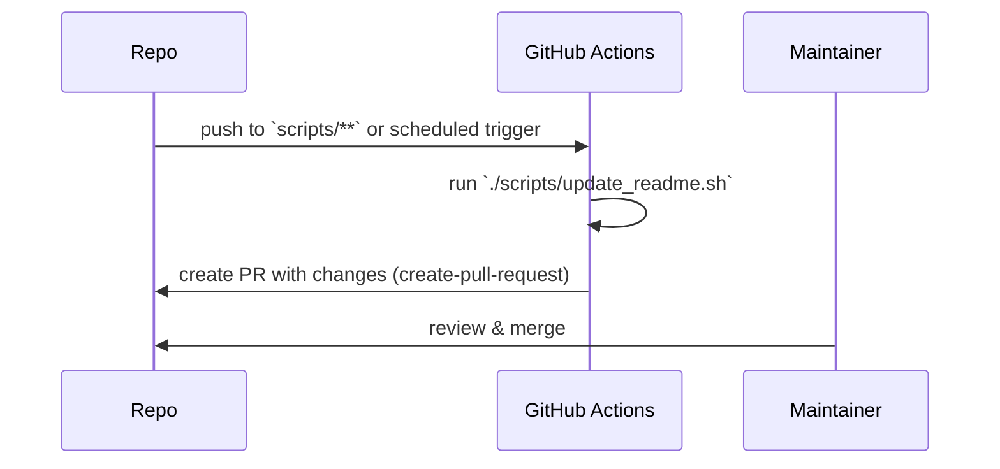

# Runbook — Elvis (operations & configuration)

This runbook documents the operational configuration, initialisation, and quick
reference for running the Elvis scraper.

## Get Transaction Data Workflow

This workflow automates the process of loading, normalising, splitting, and
fetching paginated data from seeds for lead generation, strictly following the
logic and pseudocode in README.md.

### Steps

1. **Normalise seeds.csv**

- Cleans whitespace, removes BOM, and ensures consistent CSV format.
- Supports quoted CSV fields (for example: `"Perth, WA"`) so locations may
  contain commas without breaking parsing.
- Uses:
  `awk -f scripts/lib/normalize.awk data/seeds/seeds.csv > tmp/seeds.normalized.csv`

1. **Split into per-record .txt files**

- Each record is written to `tmp/records/seed_N.txt` for modular processing.
- Uses: `sh scripts/lib/split_records.sh tmp/seeds.normalized.csv tmp/records/`

1. **Load seeds and detect pagination model**

- Loads seeds into arrays and determines the correct pagination logic for each.
- Uses: `. scripts/lib/load_seeds.sh tmp/seeds.normalized.csv` and
  `sh scripts/lib/pick_pagination.sh <url>`

1. **Paginate and fetch with backoff**

- Iterates through each page for each seed, using exponential backoff on
  failures, via `scripts/lib/paginate.sh` and `scripts/fetch.sh`.
- **Scope:** automatic scraping is limited to Seek listing pages (search/listing
  pages only). Do **not** fetch job detail pages or automatically scrape search
  engine result pages; Google/DuckDuckGo are for manual operator enrichment
  only.
- Fetch behaviour is configurable via environment variables and `project.conf`:
  - `BACKOFF_SEQUENCE` — comma-separated retry delays (default: `5,20,60`)
  - `FETCH_TIMEOUT` — curl timeout in seconds (default: `15`)
  - `UA_ROTATE` / `UA_LIST_PATH` — enable User-Agent rotation and provide the
    list file (default: `data/ua.txt` if present, otherwise
    `configs/user_agents.txt`). Lines in the UA list are cleaned (surrounding
    quotes removed, whitespace trimmed). Set `ALLOW_BOTS=true` to allow known
    crawler UAs (not recommended).
  - **HTTP 403 handling:** `RETRY_ON_403` (default `true`) and
    `EXTRA_403_RETRIES` (default `2`) control special-case behavior for `403`
    responses. When enabled, the fetcher will rotate UA and attempt extra
    retries with backoff; additional browser-like headers (`Accept`,
    `Accept-Language`, `Referer`) are sent to reduce 403 likelihood.
  - `VERIFY_ROBOTS` — when `true`, respect `robots.txt` and block disallowed
    routes. If a route is blocked the fetch will abort and be logged; review the
    route before changing verification settings.
  - `CURL_CMD` — override the curl command (useful for tests)
  - Optional: a focused fetch configuration file `configs/fetch.ini` is
    supported; use `scripts/lib/load_fetch_config.sh` to load per-deploy/local
    overrides that do not override environment variables or `project.conf`
    values unless those are unset.
- **CAPTCHA handling:** if CAPTCHA/recaptcha markers appear in responses the
  fetcher logs the event and skips the route; **do not** attempt automated
  solving.

Troubleshooting 403 / CAPTCHA:

- Inspect `logs/network.log` (ts, url, attempt, http_code, bytes) and
  `logs/log.txt` for `WARN`/`ERROR` entries.
- Check for robots blocks and their rules:
  - `grep 'ROBOTSBLOCK' logs/network.log` → confirm the Disallow prefix recorded
    matches `robots.txt` (the disallow string is written in the same
    `ROBOTSBLOCK` line).
- Check 403 events and mitigation:
  - `grep '403' logs/network.log` and `grep '403-retry' logs/network.log` → if
    many `403` events, try alternate UAs (`UA_LIST_PATH`) and slow the cadence
    (increase delays or reduce parallelism).
- Check CAPTCHA events:
  - `grep -i 'CAPTCHA' logs/network.log` or `grep -i 'CAPTCHA' logs/log.txt` →
    treat as a route-level failure; do not attempt automated solving.
- Reproduce with a mock fetcher:
  `FETCH_SCRIPT=./tests/test_fetch_behaviour.sh sh scripts/lib/paginate.sh '<url>' PAG_START`
  or run the test helper directly: `sh tests/test_fetch_behaviour.sh`.
- If a fetch fails and `tmp/last_failed.status` exists, inspect
  `.snapshots/failed/` for preserved artifacts (created by `heal.sh`). Use
  `tar -tzf .snapshots/failed/failed-<step>-<ts>.tar.gz` to list the preserved
  archive contents before extraction.
- Use `scripts/log_rotate.sh --dry-run` then run weekly (or cron) to archive
  logs and preserve the last failure marker for auditing.
- Increase `LOG_LEVEL=DEBUG` for verbose logs, try alternate UAs
  (`UA_LIST_PATH`), or tune `EXTRA_403_RETRIES` and `BACKOFF_SEQUENCE`.
- **Do not** disable `VERIFY_ROBOTS` without documented permission; if
  `ERROR: blocked by robots.txt` appears, review the seed and site policy before
  changing settings.

- Pagination is route-aware: supports `PAG_START` (offset) and `PAG_PAGE` (page
  number) models. The `PAGE_NEXT_MARKER` environment variable (or Seek INI) sets
  the HTML marker used to detect the presence of a "Next" control.
- Safety limits and delays are configurable:
  - `DELAY_MIN` / `DELAY_MAX` — per-request random delay range (seconds)
  - `MAX_PAGES` / `MAX_OFFSET` — safety stop limits to avoid runaway loops
  - `SLEEP_CMD` — command used for sleeping (`sleep` by default); can be
    overridden in tests to avoid long waits
- Uses: `sh scripts/lib/paginate.sh <base_url> <model>`

Local testing & debugging

- Run the parser locally against saved HTML to validate selectors and
  extraction: `sh scripts/parse.sh tmp/seed.htmls --out tmp/parsed.csv`
- Run pagination with a mock fetcher and custom marker (examples used in
  `tests/`):
  `FETCH_SCRIPT=./tests/mock_fetch.sh PAGE_NEXT_MARKER='data-automation="page-next"' sh scripts/lib/paginate.sh 'http://example/jobs?keywords=test' PAG_START`
- Tuning & troubleshooting tips:
  - If pages stop early after a site change, check `PAGE_NEXT_MARKER` and the
    job `data-automation` attributes in a saved page.
  - If hitting 403 frequently, review `UA_LIST_PATH`/`UA_ROTATE`, inspect
    `logs/network.log`, and consider adjusting
    `RETRY_ON_403`/`EXTRA_403_RETRIES`.
  - Use `FETCH_SCRIPT` to run deterministic unit tests that avoid network I/O.

How to triage fetch & logging

- Check recent fetch events:
  - `grep '403' logs/network.log` # find 403 events
  - `grep 'ROBOTSBLOCK' logs/network.log` # find robots blocks and rules
- See run-level warnings:
  - `tail -n 200 logs/log.txt | grep -E 'WARN|ERROR'`
- Reproduce safely (local mock):
  - `sh tests/test_fetch_behaviour.sh` or
    `FETCH_SCRIPT=./tests/test_fetch_behaviour.sh sh scripts/lib/paginate.sh '<seed>' PAG_START`
- Recover & collect artifacts:
  - If `tmp/last_failed.status` exists, run `ls -l .snapshots/failed/` and
    examine the latest tarball for debugging artifacts.
- Log rotation & retention:
  - Rotate logs weekly (policy TBD); use `scripts/summarise.sh` or
    `bin/elvis-run end-sequence --dry-run` as part of your archival/cron
    workflow. For automated rotation and retention, use
    `scripts/log_rotate.sh --keep-weeks 4` (schedule in cron).

Note: real-network integration tests are optional and disabled by default. To
run them set `REAL_TESTS=true` in your environment before running the test
suite; the test runner will skip network tests unless explicitly enabled.

1. **Orchestration**

- The entire workflow is run via: `bin/elvis-run get-transaction-data`
- Output: HTML for each seed is saved to `tmp/<seed_id>.htmls`

### Additional Utility Workflows

#### Company History Check (is_dup_company)

- Use `scripts/lib/is_dup_company.sh "Company Name" [history_file]` to check if
  a company exists in history (case-insensitive). Returns TRUE or FALSE.
- Used in deduplication and validation steps.

#### Manual Dork Selection (choose-dork)

- Use `bin/elvis-run choose-dork [dork_templates.txt]` to interactively select a
  Google dork template and open it in the browser for manual enrichment.
- Supports manual research for contact enrichment as described in the README.

Enrichment workflow (example):

1. Prepare an editable enrichment file:
   `sh scripts/enrich_status.sh results.csv --out tmp/enriched.csv --edit`
2. Manually add phone/email contacts to `tmp/enriched.csv`.
3. Validate the enriched file:
   `sh scripts/validate.sh tmp/enriched.csv --out tmp/validated.csv`
4. Finalise and (optionally) append accepted companies to history:
   `sh scripts/set_status.sh --input results.csv --enriched tmp/enriched.csv --commit-history`

#### Documentation maintenance (update_readme)

- A small maintenance helper `scripts/update_readme.sh` regenerates the
  auto-generated sections in `README.md` (the _Project tree_ and _Commands_
  sections) and is safe to run locally with
  `./scripts/update_readme.sh --dry-run`.
- A scheduled workflow `.github/workflows/update-readme.yml` runs weekly and on
  pushes to `scripts/**`. The workflow runs the update script and opens an
  automated pull request with any changes (uses
  `peter-evans/create-pull-request@v5`).
- Test: `tests/test_update_readme.sh` exercises `--dry-run` and asserts the
  auto-generated markers exist. Add this to CI if you want to block PRs that
  change scripts without updating docs.

### Environment setup (local, staging, production)

- Prerequisites (POSIX-like environment required; Cygwin or WSL on Windows):

  - `sh`, `curl`, `coreutils` (`cp`, `mv`, `find`, `tar`), `gawk` (preferred),
    `sed`, `grep`, `git`.
  - Optional: `shellcheck` for linting, `nroff`/`groff` for manpage rendering.
  - Recommended (Debian/Ubuntu):
    `sudo apt install curl coreutils gawk git shellcheck`

**Note:** `gawk` is preferred for the repository's AWK scripts; some older AWK
implementations may not support features used in `scripts/lib/*.awk`.

- Local quickstart (development):

  1. Clone the repo and install prerequisites.
  2. Copy `.env.example` to `.env` and set any overrides (e.g.,
     `FETCH_TIMEOUT`).
  3. Run `bin/elvis-run init` to validate the environment and prepare logs.
  4. Run `bin/elvis-run get-transaction-data` (or run scripts individually).

- Staging / production:
  - Run the same commands on a lightweight POSIX host (a small Linux VM or
    container). Use cron for scheduling or rely on GitHub Actions for
    orchestration. Keep `.env` values as environment variables (do not commit).

### CI / CD (operational workflows)



### Troubleshooting & common issues

- Robots.txt blocks: the fetcher honors `robots.txt` by default
  (`VERIFY_ROBOTS=true`). If you see `ERROR: blocked by robots.txt` in logs,
  verify the route and consider whether the route is safe to fetch; only disable
  verification after appropriate review.
- HTTP 403 or CAPTCHA: check `logs/network.log` for repeated 403 events. The
  fetcher will rotate User-Agent and increase retries when `RETRY_ON_403=true`.
  If you hit CAPTCHA or `recaptcha`, skip the route and log the event; do not
  attempt automated solving.
- Timeouts & retries: tune `FETCH_TIMEOUT` and `BACKOFF_SEQUENCE` in
  `project.conf` or environment for flaky networks.
- Debugging: set `LOG_LEVEL=DEBUG` and inspect `logs/log.txt` and
  `logs/network.log` for request/response traces.
- Re-run tests with network integration: set `REAL_TESTS=true` before running
  `tests/run-tests.sh` to enable optional network tests.

### Operations-relevant project layout

- `project.conf` — canonical defaults (timeouts, backoff, UA rotation)
- `scripts/` — orchestration and helpers (e.g., `fetch.sh`, `set_status.sh`)
- `scripts/lib/` — reusable helpers (e.g., `http_utils.sh`)
- `data/` — seeds and generated outputs (`data/calllists`)
- `logs/` — runtime logs and `network.log` (network fetch traces)

### Example operational commands

- `bin/elvis-run get-transaction-data` — run fetch + parse workflow
- `bin/elvis-run set-status` — validate and produce today's calllist
- `bin/elvis-run end-sequence` — archive, cleanup and summarise

### Notes

- Keep `.env` out of version control (it is in `.gitignore`). Use environment
  variables for secrets in CI.

### Error Handling

- Missing or malformed seeds file: workflow aborts with a clear error.
- Fetch failures: retried with exponential backoff, up to 3 times.
- All steps log progress and output locations.

### Example

```sh
bin/elvis-run get-transaction-data
```

This will normalise, split, detect, and fetch all seeds, saving results to
`tmp/`.

Elvis uses a modular, POSIX-compliant shell init sequence to prepare the
environment before scraping or lead generation. The init process ensures all
configuration files are loaded, required environment variables are validated,
and logging is set up.

### Init Steps

1. **Load .env**: `scripts/lib/load_env.sh` — loads environment overrides and
   secrets (optional).

## Recent changes: centralized configuration (2025-12-27)

- Pagination config loader now exports uppercase `SEEK_<SECTION>_<KEY>`
  variables (e.g., `SEEK_PAGINATION_PAGE_NEXT_MARKER`), so pagination-related
  defaults should be specified in `configs/seek-pagination.ini` or via
  environment.
- Fetch-related settings were centralised in `project.conf` (e.g.
  `CAPTCHA_PATTERNS`, `ACCEPT_HEADER`, `ACCEPT_LANGUAGE`, `RETRY_ON_403`,
  `EXTRA_403_RETRIES`, `BACKOFF_SEQUENCE`); scripts now **require** these
  variables to be present in config or `.env` and will error if missing.
- The validator now sources `project.conf` for `EMAIL_REGEX` rather than
  defining a regex inline.
- `.env.example` updated to include the new fetch and CAPTCHA variables for
  development.

These changes reduce hard-coded defaults in scripts and make operational
behaviour easier to manage via `project.conf`, `.env`, and
`configs/seek-pagination.ini`.

2. **Load project.conf**: `scripts/lib/load_config.sh` — loads canonical project
   configuration.
3. **Load Seek pagination config**: `scripts/lib/load_seek_pagination.sh` —
   loads Seek-specific selectors and pagination settings.
4. **Validate environment**: `scripts/lib/validate_env.sh` — checks all required
   variables are set.
5. **Prepare log file**: `scripts/lib/prepare_log.sh` — ensures `logs/log.txt`
   and its directory exist.

The master orchestrator is `bin/elvis-run`, which runs all steps in order:

```sh
bin/elvis-run init
```

For help and usage examples:

```sh
bin/elvis-run help
```

Each modular script can be sourced or executed directly. See
`scripts/init-help.sh` for details.

### Example: Manual Step-by-Step Init

```sh
. scripts/lib/load_env.sh
. scripts/lib/load_config.sh
. scripts/lib/load_seek_pagination.sh
. scripts/lib/validate_env.sh
. scripts/lib/prepare_log.sh
```

If any required config or variable is missing, a clear error is printed and the
process exits non-zero.

## Key files & purpose

- `.env` / `.env.example` — runtime overrides and **secrets** (highest
  precedence). Do not commit secrets. Use `.env.example` as a template when
  creating your own `.env` file.

- If rotating User-Agent is enabled (`UA_ROTATE=true`), provide
  `configs/user_agents.txt` with one UA string per line and set `UA_LIST_PATH`
  appropriately in `.env` or `project.conf`.

- `project.conf` — canonical, non-secret operational defaults (key=value).
  Scripts should use this as the single source of truth for defaults.
- `configs/seek-pagination.ini` — Seek-specific selectors and per-seed override
  examples. Keep site logic here.
- `data/seeds/seeds.csv` — seed list with header `seed_id,location,base_url`.
  Use `seed_id` to tie to per-seed overrides.

## Precedence (always follow)

1. Environment variables / `.env` (highest)
2. `project.conf`
3. Built-in script defaults (lowest)

Scripts should load configuration in that order and **log** which source
provided each setting for auditability.

## Practical usage examples

1. Set a runtime override locally (temporary):

FETCH_TIMEOUT=10 bin/elvis-run init

1. Permanent operational default (project-level): edit `project.conf`:

FETCH_TIMEOUT=15

1. Secrets (API keys, notification credentials): place only in `.env` or use a
   secret manager and ensure `.env` is in `.gitignore`.

2. Run all init steps and start a new log:

bin/elvis-run init

1. Show help for all init scripts:

bin/elvis-run help

1. Run tests for the init workflow:

tests/run-tests.sh

## Seeds & per-seed overrides

- Keep seeds in `data/seeds/seeds.csv` with `seed_id` column. Example row:

  seek_fifo_perth,"Perth,
  WA",<https://www.seek.com.au/fifo-jobs/in-All-Perth-WA>

- Per-seed overrides live in `configs/seek-pagination.ini` under `[overrides]`
  and are keyed by `seed_id` (example in the file comments).

```sh
grep -E '^[A-Z0-9_]+=.\*' project.conf > "$tmp_conf"
done < "$tmp_conf"

```

## Modular Init Scripts Reference

- `scripts/lib/load_env.sh` — Loads `.env` (if present) into the environment.
- `scripts/lib/load_config.sh` — Loads `project.conf` into the environment.
- `scripts/lib/load_seek_pagination.sh` — Loads Seek pagination config as
  SEEK\_\* variables.
- `scripts/lib/validate_env.sh` — Validates all required environment variables.
- `scripts/lib/prepare_log.sh` — Ensures log file and directory exist.
- `scripts/init-help.sh` — Prints help and usage for all init scripts.
- `bin/elvis-run` — Orchestrates the full init sequence and all workflows,
  including choose-dork and is_dup_company.

## Utility Scripts

- `scripts/lib/is_dup_company.sh` — Checks if a company name exists in history
  (case-insensitive).
- `scripts/choose_dork.sh` — Interactive dork template selector for manual
  enrichment.

All scripts are POSIX-compliant and provide clear error messages on failure.

## Testing the Init Workflow

Run all tests for the init sequence:

```sh
tests/run-tests.sh
```

This will check config loading, environment validation, and log setup. All tests
should pass for a correct setup.

### ShellCheck (recommended)

We recommend installing `shellcheck` for local linting and CI checks.
`shellcheck` helps catch common shell scripting errors and enforces good
practices. The test suite will run `shellcheck -x` (if available) across all
`.sh` files.

- Install (macOS/Homebrew): `brew install shellcheck`
- Install (Debian/Ubuntu): `sudo apt install shellcheck`
- Run locally:

```sh
shellcheck -x bin/elvis-run scripts/lib/*.sh scripts/*.sh
```

- VS Code: set the workspace setting to follow sources (see
  `.vscode/settings.json`):

```json
{
  "shellcheck.extraArgs": ["-x"]
}
```

If `shellcheck` is not installed the test runner will SKIP the lint step and
continue. Installing it is recommended for contributors and CI to ensure script
quality and maintainability.

### Cygwin / Windows note

On Cygwin, ShellCheck installed under Windows (Scoop/Chocolatey) may not accept
POSIX paths by default. We provide a small wrapper
`scripts/lib/shellcheck-cygwin-wrapper.sh` that converts POSIX file paths to
Windows paths and calls the Windows `shellcheck.exe`. To use it, set the
`SHELLCHECK` environment variable to the Windows executable's POSIX path
(example shown), or place the wrapper earlier in your `PATH`.

Example (Cygwin):

```sh
WINPATH=$(cmd.exe /c "where shellcheck" 2>/dev/null | tr -d '\r' | sed -n '1p')
[ -n "$WINPATH" ] && export SHELLCHECK="$(cygpath -u "$WINPATH")"
```

Once set, re-run `./tests/run-tests.sh` and the test runner will use the wrapper
and the Windows ShellCheck.

## Troubleshooting & change detection

- If any init step fails, check the error message for missing files or
  variables.
- If pagination fails across seeds, check `configs/seek-pagination.ini`
  selectors and `page_next_marker` first.

## End‑sequence workflow (archive, cleanup, summarise) 🔧

Purpose: Perform end-of-run housekeeping to make the run auditable and to remove
temporary artefacts before next runs. The workflow performs three modular steps
in order:

1. **Archive** — create a timestamped tarball under `.snapshots/` containing key
   artefacts (`data/calllists/`, `companies_history.txt`, `logs/`), write a
   checksum to `.snapshots/checksums/`, and append an entry to
   `.snapshots/index`.

2. **Cleanup** — safely remove temporary files (default: `tmp/` contents), and
   optionally remove files older than N days using `--keep-days`.

3. **Summarise** — write a concise `summary.txt` in the repository root with run
   metadata: latest snapshot name, archived file count, calllist count and
   logged warnings.

Usage (CLI):

```sh
# Run the full end-sequence workflow
bin/elvis-run end-sequence

# Run as a dry-run (no destructive actions)
bin/elvis-run end-sequence --dry-run

# Skip archiving (useful for debugging)
bin/elvis-run end-sequence --no-archive

# Continue on error (try and finish other steps)
bin/elvis-run end-sequence --continue-on-error

# Provide a descriptive label for the snapshot
bin/elvis-run end-sequence --snapshot-desc "daily end-run"

# Enable automatic recovery attempts (opt-in)
bin/elvis-run end-sequence --auto-heal

Notes & safety:

- **Auto-heal is opt-in and disabled by default.** Use `--auto-heal` to allow the
  orchestrator to attempt restoration and re-run of failed steps.
- Recovery attempts preserve failed artifacts under `.snapshots/failed/` and
  always log recovery actions for auditability.
- Auto-heal behaviour respects `--continue-on-error` and will not attempt infinite retries by default.
```

Snapshot & append workflow (operational steps):

1. Create a snapshot before changes:
   `tar -czf .snapshots/snap-$(date -u +%Y%m%dT%H%M%SZ).tar.gz companies_history.txt data/calllists logs && sha1sum .snapshots/snap-<ts>.tar.gz > .snapshots/checksums/snap-<ts>.sha1`
2. Verify snapshot: `sha1sum -c .snapshots/checksums/snap-<ts>.sha1`
3. If appending company names, run
   `sh scripts/deduper.sh --in tmp/validated.csv --out tmp/deduped.csv --append-history`
   and review `companies_history.txt` afterwards.

Cron example (weekly rotation):

- `0 3 * * 0 cd /path/to/repo && ./scripts/log_rotate.sh --keep-weeks 8`

Implementation notes:

- Scripts:

  - `scripts/lib/archive.sh` — `archive_artifacts` function and helpers
  - `scripts/archive.sh` — wrapper CLI
  - `scripts/lib/cleanup.sh` — `cleanup_tmp` function
  - `scripts/cleanup.sh` — wrapper CLI
  - `scripts/lib/summarise.sh` — `generate_summary` function
  - `scripts/summarise.sh` — wrapper CLI
  - `scripts/end_sequence.sh` — orchestrates the three steps

- The orchestration is available via `bin/elvis-run end-sequence` and writes run
  details to `logs/log.txt` and `summary.txt`.

- Tests added in `tests/run-tests.sh` cover archive, cleanup and summary
  behaviours.

Notes:

- The end-sequence workflow follows the project's archiving, checksum and index
  conventions as described in `README.md` (see "Mini VCS Integration").
- These scripts are POSIX-compliant and include safety checks to avoid
  accidental deletion of non-temporary files. Always use `--dry-run` when
  testing on new environments.

- If run behaviour differs between environments, ensure you check the effective
  source for keys (env vs `project.conf`) by adding logging to the script.
- If pagination fails across seeds, check `configs/seek-pagination.ini`
  selectors and `page_next_marker` first.
- If run behaviour differs between environments, ensure you check the effective
  source for keys (env vs `project.conf`) by adding logging to the script.

## Migration note

- `config.ini` was deprecated and retained only for reference; move any required
  non-secret keys from `config.ini` into `project.conf` and remove references to
  `config.ini` in automation scripts.

## Set-status workflow — Enrich, Validate, Deduplicate, Audit ✅

This workflow supports updating result records (`results.csv`) with manual
enrichment by an administrator and producing a final daily calllist with updated
statuses and an audit trail. Use `is_dup_company.sh` for history checks and
`choose-dork` for manual enrichment as needed.

Quick steps:

1. Prepare `results.csv` with expected headers:
   `company_name,prospect_name,title,phone,email,location`.
2. Run `scripts/enrich_status.sh results.csv --out tmp/enriched.csv --edit` to
   create an editable copy and print instructions for manual enrichment (it does
   **not** open an editor automatically).
3. After enrichment, run
   `scripts/set_status.sh --input results.csv --enriched tmp/enriched.csv --commit-history`
   to validate, dedupe and produce `data/calllists/calllist_YYYY-MM-DD.csv`.
4. Logs are written to `logs/log.txt` and audit records to `audit.txt`.

Notes & behaviour:

- Validation checks: required fields, at least one contact (phone or email),
  email regex, and phone normalisation (converts `+61` prefixes to `0` and
  strips non-digits).
- **Validation workflow:** Run
  `sh scripts/validate.sh <input.csv> --out <validated.csv>`; invalid rows are
  printed to stderr in the form `INVALID <line> <reason>` and must be fixed in
  the enrichment file before re-running validation.
- Deduplication: case-insensitive match on `company_name` against
  `companies_history.txt` (append-only). Use
  `sh scripts/deduper.sh --in <validated.csv> --out <deduped.csv> --append-history`
  to append newly accepted companies to history; omit `--append-history` to run
  non-destructively and inspect `tmp/new.tmp` for the new names.
- MIN_LEADS behaviour: `MIN_LEADS` defaults to `25` (configurable via
  `project.conf` or environment). If fewer than `MIN_LEADS` are produced the
  pipeline logs a warning but still writes the CSV.
- The workflow is orchestrated by `scripts/set_status.sh` and is available via
  `bin/elvis-run set-status`.

Validate & fix

- Run: `sh scripts/validate.sh <input.csv> --out <validated.csv>`
- If validation fails, check stderr for lines like `INVALID 4 missing contact`
  and edit the enriched file to add phone or email, then re-run validation.

Deduplicate & optionally append to history

- Run:
  `sh scripts/deduper.sh --in <validated.csv> --out <deduped.csv> --append-history`
- Inspect `companies_history.txt` after append. To run non-destructively, omit
  `--append-history` and review `tmp/new.tmp` (the script’s output of newly
  accepted names).

Troubleshooting tips

- Missing columns → check the CSV header formatting and quoting (use
  `scripts/lib/normalize.awk` for seeds; ensure enrichment file lines are valid
  CSV).
- Phone oddities → ensure `+61` numbers are present (the validator converts
  `+61` → `0` and strips non-digits).
- If `set_status.sh` logs low leads: check validation/dedupe results and manual
  enrichment steps.

Quick commands for operators

- Prepare for enrichment:
  `sh scripts/enrich_status.sh results.csv --out tmp/enriched.csv --edit`
- Validate edited file:
  `sh scripts/validate.sh tmp/enriched.csv --out tmp/validated.csv`
- Finalise (produce and optionally append to history):
  `sh scripts/set_status.sh --input results.csv --enriched tmp/enriched.csv --commit-history`

Example (non-interactive):

sh scripts/set_status.sh --input results.csv --enriched tmp/enriched.csv
--out-dir data/calllists --commit-history

This will run validation, deduplication (appending history), produce the daily
CSV, and write audit/log entries.

---

Keep this runbook updated when configuration practices, file locations, or init
scripts change.
